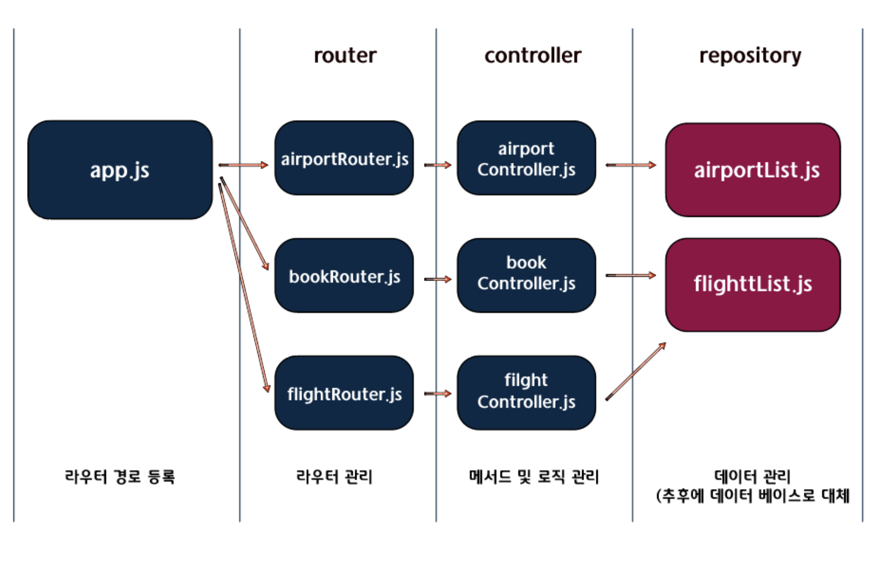

# server statesairline spint 핵심 정리!!!
이번 스프린트의 목적은 해당 메서드에 대한 로직을 짜서 테스트 케이스를 통과해라!!! 가 아닙니다. 그럼 뭐가 중요할까요? 바로 폴더 구조는 어떤식으로 구성이 되어있는지 혹은 그폴더 내에서 `router`,`controller`가 어떠한 역할을 하고 수행하는지 파악하는게 가장 중요합니다. 그래서 이번 시간에서는 해당 스프린트에 대한 폴도 구조를 파헤쳐 보는 시간을 가져 보겠습니다!!!

<br />

---

## 한눈에 알아보는 폴더 구조
우선 폴도구조를 명확하게 파악하는게 중요합니다. 한번 아래 이미지를 통해 어떤식으로 폴더 구조가 구성되어있는지 파악해봅시다!!!
<br />


---

## app.js파일 둘러보기 (관리할 라우터 등록하기)
app.js파일에서 주목해야 될 부분은 밑에 있는 세줄입니다. 이 세줄의 의미는 대충 어떤 경로를 나타 내는 거구나~ 하고 파악할수 있습니다. 정확하게 표현하자면 라우터에서 공통적인 요청 처리 해야할 API가 반복되는 것을 통합시켜준것이라고 생각하면 되겠습니다.

<br />

```js
//app.js파일
//...생략
// 각각 라우터에 있는 폴더를 변수에 담아 줍니다.
const flightRouter = require('./router/flightRouter');
const bookRouter = require('./router/bookRouter');
const airportRouter = require('./router/airportRouter');

app.use(cors());
app.use(express.json());

// use메서드를 활용해서 관리 할 라우터 등록을 하고 콜백함수로 각각 폴더에 접근할수 있습니다.
app.use('/flight', flightRouter);
app.use('/book', bookRouter);
app.use('/airport', airportRouter);

//... 생략
```

---

## router폴더 둘러보기 (flightRouter파일 보기)
router폴더를 확인해보면 `airport` `book` `flight` Router로 3가지 파일이 있습니다. 라우터 폴더 역할은 API요청 마다 라우팅 처리 할 것을 모아둔 곳이라고 생각하면 편합니다. 그리고 라우터 폴더중에서 대표적으로 flightRouter파일을 살펴 봅시다!

<br />

```js
//app.flightRouter파일
const { findAll, findById, update } = require('../controller/flightController'); //컨트롤러에 있는 메서드 가져오기
const exress = require('express');
const router = exress.Router(); //라우터 모듈 가져오기

router.get('/', findAll);

router.get('/:id', findById);

router.put('/:id', update);

module.exports = router;
```
<br />
어떻게 느껴지나요 ? 아마 이것만 보고는 파악하기 어렵습니다. 그래서 직관적인 이해를 위해서 아래 예제를 확인해 봅시다! 아래 예제는 flight에 findAll을 요청했을 경우의 예시이며 라우터 처리와 로직파일을 분리 안한경우와, 라우터처리는 했고 로직파일을 분리 안한경우, 라우터처리와 로직파일을 분리한 경우 이 3가지를 나타 낸 겁니다.

```js
const { findAll } = require('../controller/flightController');
const exress = require('express');
const router = exress.Router();

//1. 라우터 처리와 로직파일을 분리 안한경우
router.get('/flight/', async (req, res) => {
    //TODO: 
       // findAll 로직 작성

    return res.json(flights);
  },);

//2. 라우터 처리는 하였고 로직파일을 분리 안한 경우
router.get('/', async (req, res) => {
    //TODO: 
        //findAll 로직 작성

    return res.json(flights);
  },);

//3. 라우터 처리와 로직파일을 분리한 경우
router.put('/', findAll);

```
<br />
위에 있는 예제와 지금예제를 비교해보면 지금예제의 3번이 위에 있는 예제와 똑같고 라우팅을 따로 분리해서 작성하는게 관리하기가 엄청 편합니다. 만약에 라우터 처리와 로직파일을 분리하지 않으면 1번 2번 예제 처럼 코드가 복잡해질 가능성이 크고 유지보수하기가 너무 어렵습니다. 그래서 3번 처럼 라우터와 로직파일(controller폴더)을 따로 분리해서 작성을 해준겁니다.

---

## 내용 요약 정리

이번 스프린트의 목적은 라우터 처리와 로직파일을 분리해서 각각 어떤 역할을 하고 수행하는지 파악하는것입니다.<br />
다시 요약을 하자면 app.js에서 라우팅 처리할 것을 use를 통해 등록을 해주고 라우터 파일에서 공통적인 요청을 처리해야할 반복 되는 API를 통합시켜 라우팅 처리를 하고 컨트룰러 역할은 각각의 메서드나 로직들을 모아서 관리한다라고 생각하면 되겠습니다.<br>

한줄요약 : 폴더로 각각 라우터 처리와 로직파일을 분리시키면 유지보수하기가 매우 용의하고 관리하기 편리 하다!