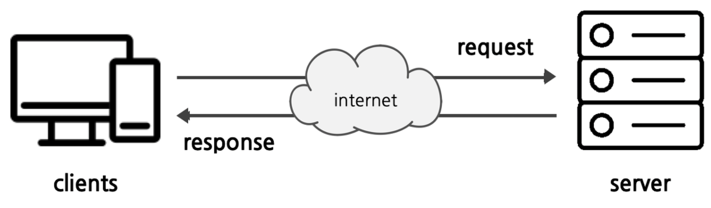
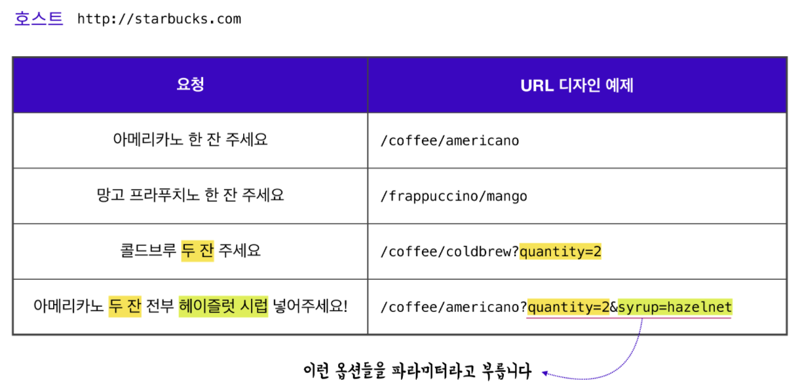
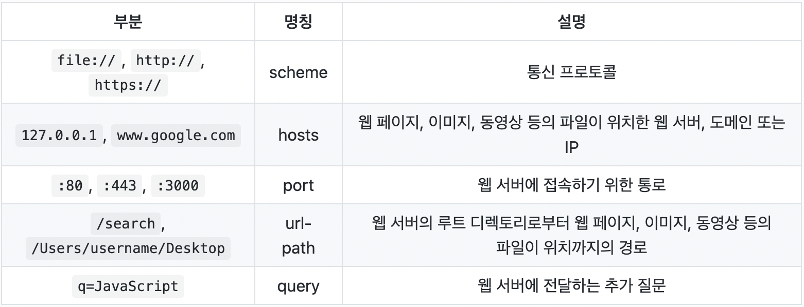
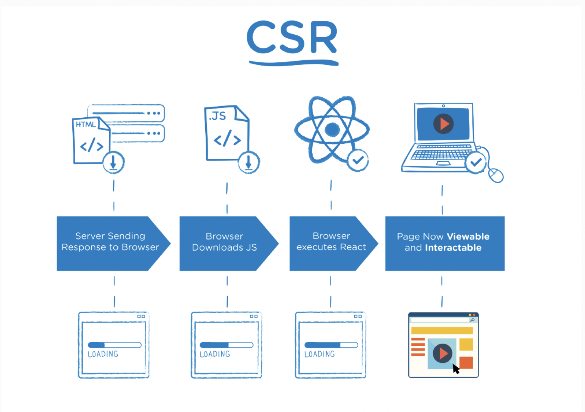

# 네트워크 기초
1. 클라이언트-서버 콘셉트 이해하기! 
2. 브라우저의 작동 원리 이해하기! 
3. http messages의 구조 

## 1. 클라이언트와 서버
기본적으로 클라이언트 서버 아키텍쳐, 다른말로는 2티어 아키텍처라고 부릅니다. 
웹브라우저와 같이 서버에 접속하기 위한 사용자를 클라이언트라고 부릅니다. 
서버란 서비스를 제공하는 컴퓨터입니다. 페이지 지원이나, 공유 데이터의 처리 및 저장등을 합니다. 

### HTTP(Hyper Text Transfer Protocol) 
프로토콜(protocol)은 통신 규약, 즉 클라이언트와 서버 간의 통신 약속입니다.    
브라우저와 서버간에 데이터를 주고 받기 위해 사용하고 있습니다.   

### HTTP의 특징
1. client의 요청이 있을 때만 서버가 응답하는 단방향 통신 입니다. 
2. 서버가 요구하는 API에 맞게 요청해야 응답을 받을 수 있습니다.  
3. stateless(무상태성) 모든 http 요청은 독립적이며 서버는 클라이언트의 상태를 기억하지 못합니다. 

### API(Application Programming Interface)
서버는 클라이언트에게 리소스를 잘활용할수 있도록 인터페이스를 제공합니다. 이를 API라고 부르고 
클라이언트가 요청을 잘할수 있도록 도와주는 메뉴판이라고 생각하면 됩니다.  

## 2. 브라우저의 작동 원리(보이지 않는 곳)

### URL, URI
URL은 자원의 위치를 알려주기 위한 프로토콜입니다 브라우저는 URL을 이용하여 자원의 위치를    
찾을수 있습니다. URL은 scheme, hosts,url-path로 구분 할 수 있고 여기서 query,bookmark를 
더한 것이 URI입니다. 브라우저의 검색창을 클릭하면 나타나는 주소가 URI이고 URI는 URL을 포함하는 상위 개념입니다.   

### IP, PORT 
IP는 Internet Protocol의 줄임말로, 인터넷상에서 사용하는 주소체계를 의미합니다.    
Port는 IP주소가 가리키는 pc에 접속할수 있는 통로(채널)를 의미힙나다.   

잘알려진 포트번호  
22 : SSH  
80 : HTTP  
443: HTTPS  

### Domain, DNS 
웹 브라우저를 통해 특정 사이트를 진입 할때, IP 주소를 대신하여 사용하는 주소를 도메인이라고 합니다.    
DNS는 Domain Name System의 줄임말로, 호스트의 도메인 이름을 ip주소로 변환하거나 반대의 경우를 
수행할 수 있도록 개발된 데이터베이스 시스텝입니다. 

### 크롬 브라우저 에러 읽는 법 
크롬 브라우저를 실행 할때 가끔 에러 페이지나 메세지를 본 경험이 있습니다! 이는 웹페이지를 제공하는  
서버와 크롬 브라우저가 소통하는 단계에서 해석 할 수 없는 데이터를 전송 받은 경우에 발생합니다.  

다음 에러 메시지가 나타난다면, 페이지를 여는 중에 문제가 발생했다는 뜻입니다. 

## 2-2. 브라우저의 작동 원리(보이는 곳)

### SSR, CSR

1. SSR은 Server Side Rendering의 줄임말로 SEO가 우선순위 인경우 사용합니다. 
2. 웹 페이지의 첫 화면 렌더링이 빠르게 필요할 경우, 단일 파일의 용량이 작은 SSR이 적합합니다. 
3. 웹 페이지가 사용자와 상호작용이 적은 경우, SSR을 활용 할 수 있습니다. 

1. SEO가 우선순위가 아닌경우, CSR을 이용할 수 있습니다. 
2. 사이트에 풍부한 상호 작용이 있는 경우, CSR은 빠른 라우팅으로 강력한 사용자 경험을 제공합니다. 
3. 웹 어플리케이션을 제작하는경우, CSR을 이용해 더 나은 사용자 경험을 제공 할수 있습니다(빠른동적렌더링 등) 

SSR, CSR 차이점   
CSR과 SSR의 주요 차이점은 페이지가 렌더링되는 위치입니다. SSR은 서버에서 페이지를 렌더링하고,  
CSR은 브라우저(클라이언트)에서 페이지를 렌더링합니다. 브라우저는 사용자가 다른 경로를 요청할 때마다 
페이지를 새로고침 하지 않고, 동적으로 라우팅을 관리합니다. 

## 3. http messages의 구조

### HTTP messages
http messages는 클라이언트와 서버 사이에서 데이터가 교환되는 방식이며 요청과 응답 할수 있습니다.  
요청(Requests)과 응답(Responses)은 다음과 같은 유사한 구조를 가집니다.  

1. start line : start line에는 요청이나 응답의 상태를 나타냅니다. 항상 첫 번째 줄에 위치합니다. 응답에서는 status line이라고 부릅니다. 
2. HTTP headers : 요청을 지정하거나, 메시지에 포함된 본문을 설명하는 헤더의 집합입니다. 
3. empty line : 헤더와 본문을 구분하는 빈 줄이 있습니다. 
4. body : 요청과 관련된 데이터나 응답과 관련된 데이터 또는 문서를 포함합니다. 요청과 응답의 유형에 따라 선택적으로 사용합니다. 

### HTTP Request Method
http 요청 메서드를 사용해서 URL에 접근하여 서버에 특정 데이터를 요청 할 수 있습니다.

GET : 존재하는 데이터를 요청 
POST : 새로운 데이터를 생성 
PUT : 존재하는 데이터를 변경 (modify) 
PATCH : PUT이랑 같은 개념이지만 교체의 개념이 더 크다(replace) 
DELETE : 존재하는 데이터를 삭제 

고로 http 요청 메서드는 조회, 생성, 변경, 삭제를 할 수 있습니다. 

### HTTP Status Code
http 상태 코드는 클라이언트의 요청에 의해 서버가 응답해주는 정보입니다. 주요 상태 코드는  
100~500번대 까지 각각 다른 의미로 다양하게 있습니다.

#### 1xx 처리중에 있습니다

#### 2xx 성공 : 
200번대의 상태 코드는 대부분 성공을 의미합니다.
#### 3xx 리디렉션 : 
300번대의 상태 코드는 대부분 클라이언트가 이전 주소로 데이터를 요청하여 서버에서 새 url로 리디렉트를 유도하는 경우입니다.
#### 4xx 클라이언트 요청오류 : 
400번대의 상태 코드는 대부분 클라이언트의 코드가 잘못된 경우입니다. 유효하지 않은 정보를 요청했거나 권한이 잘못 되었을 경우 발생합니다.
#### 5xx 서버 에러 : 
500번대 상태 코드는 서버 쪽에서 오류가 난 경우입니다. 