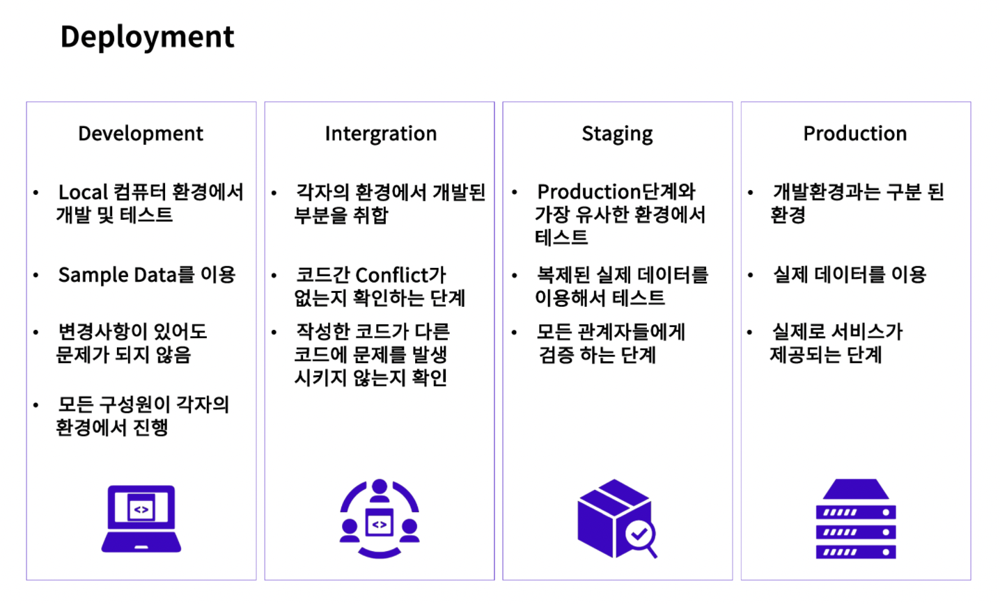
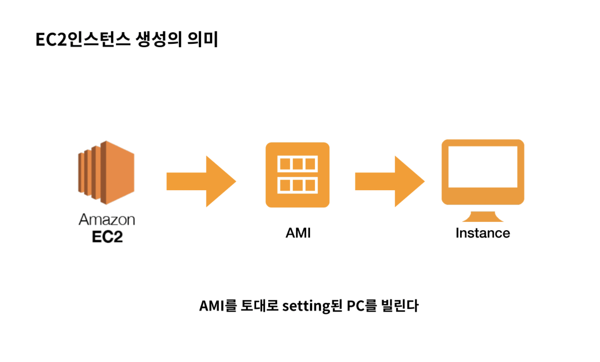

# AWS 용어 정리

## Cloud Computing

기존 서버의 방식은 전산실 등에 컴퓨터를 배치하고 인터넷을 연결하여 서비스를 제공했습니다. 하지만 주기적인 관리와 공간의 한계로 인해 이 방식은 쓰지 안헥 됩니다. 그래서 서버의 자원과 공간, 및 네트워크 환경을 빌려 사용하는 클라우드 컴퓨팅이 시작됩니다.

 

### 클라우드 특징
- 서버의 자원과 공간, 및 네트워크 환경 제공
- 필요할 때마다 컴퓨팅 능력을 유연하게 조절
- 사용한 만큼의 요금만 지급
- 다른 컴퓨터로 즉시 이주가 가능

 

### 온프레미스
- 데이터 센터에서 서버의 자원과 공간 및 네트워크 환경을 제공

 

### 클라우드의 단점
- 클라우드 서비스 종속
- 서비스에 영향을 미침

 

## Deploy

배포란 개발한 서비스를 사용자가 이용가능하게 하는 과정입니다.

 

## EC2

EC2는 클라우드 컴퓨팅 서비스 입니다. 쉽게 말해 AWS에서 원격으로 제어할 수 있는 가상 컴퓨터 입니다. 이는 곧 인스턴스라고도 부릅니다. EC2는 어디서든 클릭하나로 쉽게 사용할수 있고 다양한 운영체제에 대한 선택이 가능한 이점이 있습니다.

 

- AMI란 소프트웨어 구성이 기재된 탬플릿입니다.

 

## RDS

RDS는 Relational Database Service의 약자로 AWS에서 제공하는 관계형 데이터 베이스 서비스 입니다. RDS를 이용하면 데이터베이스 유지보수와 관련된 일들을 RDS에서 전적으로 자동 관리합니다. ec2에서 데이터베이스를 설치하면 개인이 관리해야 해서 부담이 큽니다. 그래서 RDS를 사용면 초기 설정을 제외하고 데이터베이스에 저장된 데이터를 관리해주기때문에 엄청난 이점이 있습니다.

 

## S3

S3는 AWS에서 제공하는 클라우드 스토리지 서비스 입니다. S3에 가장 큰 장점은 데이터를 무한히 저장 가능합니다. 즉 확장성이 높으면 많은 시간과 수고를 들이지 않고 스토리지 규모를 확장/축소 할 수 있습니다. 또한 사용한 만큼만 비용을 지불하면 되기 때문에 비용적인 측면에서도 효율적입니다. 그리고 내구성과 가용성이 보장됩니다.

 

### S3 특징

1. 확장성, 내구성, 가용성 우수

2. 다양한 스토리지 클래스를 제공 
S3 standard : 일반적으로 사용, 데이터에 자주 액세스해야 할 경우 사용  
S3 Glacier : 데이터 장기보관 목적, 비용이 저렴

3. 정적 웹 사이트 호스팅이 가능
정적파일 : 서버의 개입 없이 클라이언트에 제공될 수 있는 파일  
웹호스팅 : 서버의 한 공간을 빌려주어 웹 사이트의 배포, 운영이 가능하게 만들어주는 서비스  
S3에서는 버킷을 통해 정적 웹 사이트 호스팅이 가능

### S3 핵심 개념

1. 버킷
- 버킷은 파일을 담는 바구니(최상위 디렉토리)
- 무한히 많은 파일을 저장 가능
- 버킷의 이름은 각 리전에서 고유해야 함
- 버킷의 정책을 생성하여 액세스 권한을 부여 가능

 

2. 객체
- 객체는 버킷에 담기는 파일
- 객체는 파일과 메타데이터로 구성
- 모든 객체는 고유한 키를 가짐
- URL 주소를 통해서 객체에 접근 가능
- URL 주소형식 : http://[버킷 이름].S3.amzonaws.com/[객체의 키]

 

## 빌드

- 불필요한 데이터를 없애고, 통합/압축하여 배포하기 최적화된 상태를 만드는 것
- 데이터의 용량이 줄어들고 웹 사이트 로딩 속도가 빨라집니다.
