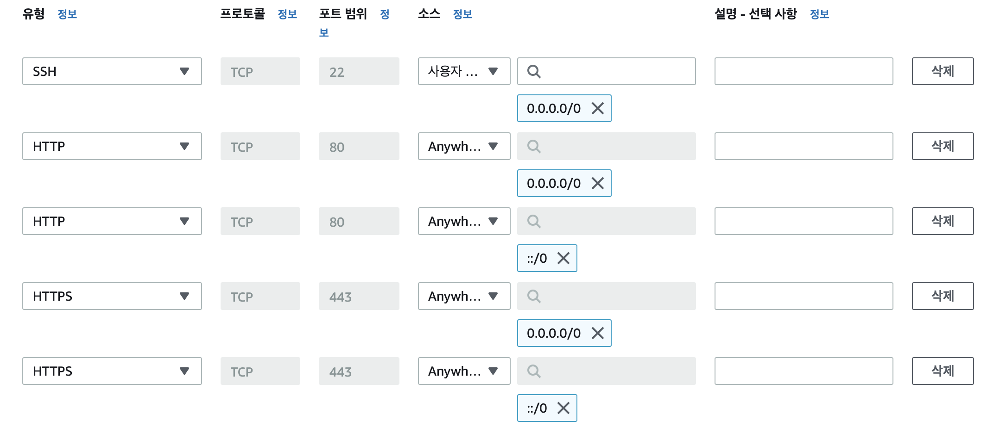

# AWS배포 과정_서버

---

# 인스턴스 생성/연결

## 1. AMI 선택하기

AWS사이트에가서 인스턴스 시작을 누르고 AMI를 선택합니다.

<br />

## 2. 키 페어 생성

인스턴스를 연결할 키를 만들어 줍니다.

<br />

## 3. EC2 인스턴스 생성

인스턴스를 생성하고 구분하기 위해 이름을 설정합니다.

<br />

## 4. 보안 그룹 설정하기

만든 인스턴스의 보안 그룹을 아래와 같이 설정합니다.



<br />

## 5. EC2 연결

1. 인스턴스 창에가서 연결 버튼을 누르고 SSH클라이언트에 들어가서 퍼블릭DNS 주소를 확인합니다.

<br />

2. 터미널 창에 SSH접속을 위해 아까만든 pem키 파일에 권한을 400으로 수정합니다.
```
& chmod 400 {key_pem}
```

<br />

3. 터미널 창에 아래와 같이 입력해서 연결해줍니다.
```
ssh -i "{pem key id}" ubuntu@{퍼블릭DNS}.compute.amazonaws.com
```

하고 무슨창이 뜨면 yes 하면 가상컴퓨터에 접속이 됩니다!

<br />

# 인스턴스 서버실행

## 1. 개발 환경 구축

(우분트 예시)  
가상컴퓨터에서 아래와 같이 설치합니다. nvm 설치가 안되면 [여기서](https://github.com/nvm-sh/nvm) 참조해서 다운 받습니다. 설치 되면 다시 껏다 연결해서 nvm install node 순으로 설치합니다.

```
sudo apt update
nvm install node
sudo apt install npm
```

<br />

## 2. git clone

깃클론해서 개인토큰키를 가져와서 클론합니다. [개인토큰키 받는방법](https://jootc.com/p/201905122828)  


```
ubuntu@ip-172-31-31-190:~$ git clone https://github.com/codestates/im-sprint-practice-deploy.git
Cloning into 'im-sprint-practice-deploy'...
Username for 'https://github.com': 깃아이디
Password for 'https://leejanghe@github.com': 개인토큰키 입력
```

<br />

아래 예시는 복사해서 다른 터미널 하나 만들어서 진행(권장 x)

```
scp -i "aws_de_pair.pem" -r ./im-sprint-practice-deploy/ ubuntu@-----------.compute.amazonaws.com:/home/ubuntu
```

<br />


## 3. EC2 인스턴스에서 서버 실행

서버디렉토리에서 npm install을 하고 sudo npm start를 해서 실행이 잘되는지 확인합니다.

<br />

## 4. PM2 (선택사항) 하는게 좋긴함

PM2를 쓰는이유는 EC2연결을 한 터미널창을 끄면 프로세스가 강제 종료 됩니다. 이를 방지하고자 PM2를 사용합니다.

```
npm install pm2 -g
```

설치가 완료되면 아래와 같이 순서대로 설치합니다

```
sudo apt-get update
sudo apt-get install authbind
sudo touch /etc/authbind/byport/80
sudo chown ubuntu /etc/authbind/byport/80
sudo chmod 755 /etc/authbind/byport/80
authbind --deep pm2 update
```

<br />


