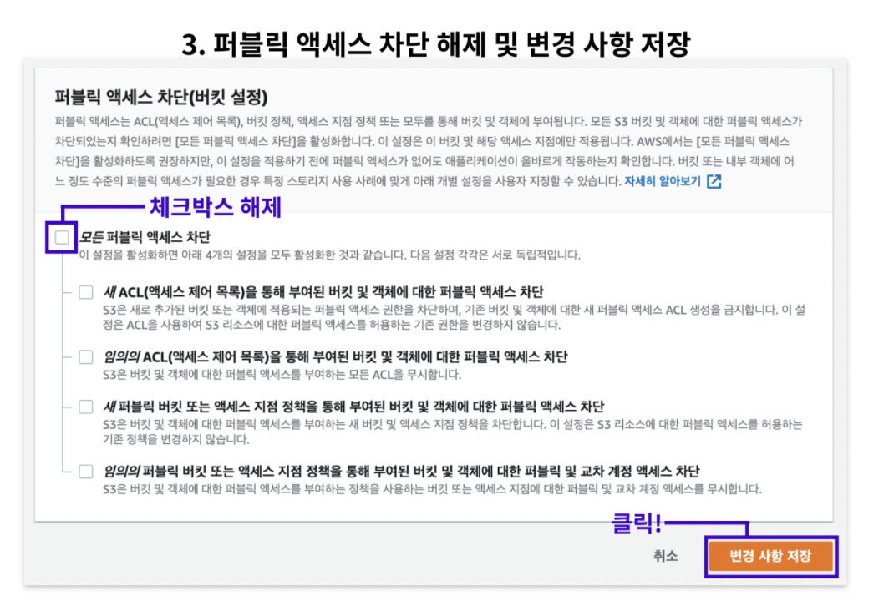
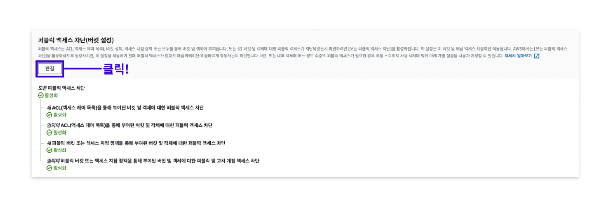
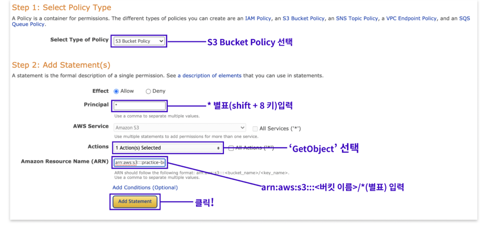

# AWS배포 과정_클라이언트

---

# 웹페이지 빌드하기

## 1. 클라 env파일 수정

클라이언트 디렉토리에 가서 npm i 설치를 합니다.  
클라이언트 env파일에서 ec2주소(퍼블릭 IPv4 DNS)를 넣어야 합니다.  
주의할점은 http://를 꼭 포함해야 합니다.  

<br />

## 2. 빌드하기

```
npm run build
```

빌드를 하면 빌드 폴더가 생성됩니다.

<br />

# 버킷만들기

## 1. S3가서 버킷 만들기

버킷을 만들고 속성에가서 정적 웹사이트 호스팅을 활성화로 선택해줍니다.

<br />

## 2. 파일 업로드하기

S3에 가서 객체에 아까전에 빌드한 파일과 폴더를 업로드 합니다.

<br />

## 3. 권한 설정하기



<br />



퍼블릭 액세스 차단 메누의 편집을 클릭하고 체크 박스를 해제하고 변경 사항을 저장합니다.

<br />

권한 메뉴의 버킷 정책 부분을 편집하기 위해 버킷 정책 생성기를 클릭해서 아래와 같이 작성합니다.

<br />



<br />

생성된 정책 복사 붙이기를 하고 변경 사항을 저장합니다.

<br />

## 4. 테스트 진행

속성 메뉴로 이동해서 테스트를 진행합니다. (ec2에서 서버가 켜져있어야 잘 진행됩니다)