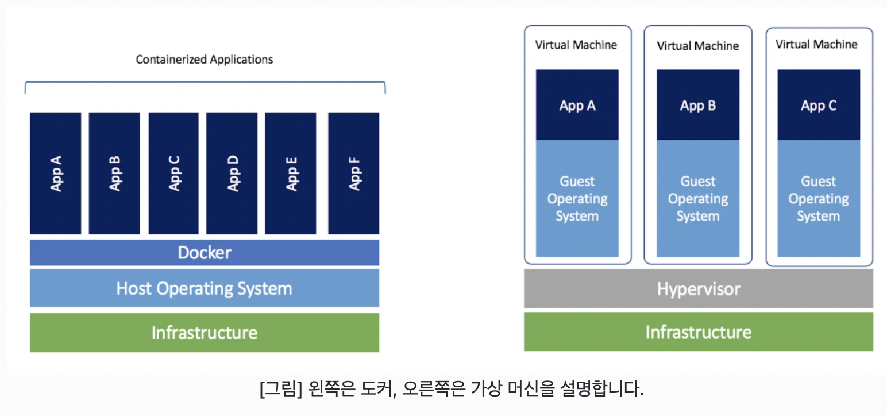

## Docker

도커는 리눅스 컨테이너 기술을 기반으로 하는 오픈소스 서비스입니다. **도커를 통해 애플리케이션 실행 환경을 코드로 작성할 수 있으며, OS를 격리화하여 관리합니다** 

 

### Linux Container

리눅스 컨테이너는 필요한 라이브러리와 애플리케이션을 모아서 마치 별도의 서버처럼 구성한 것을 말합니다. (네트워크 설정, 환경변수 등 시스템 자원은 각 컨테이너가 독립적으로 소유)

리눅스 컨테이너 특징  

1. 프로세스의 구획화
- 특정 컨테이너에서 작동하는 프로세스는 기본적으로 그 컨테이너 안에서만 엑세스 할 수 있습니다.
- 컨테이너 안에서 실행되는 프로세스는 다른 컨테이너의 프로세스에게 영향을 줄 수 없습니다.  

2. 네트워크의 구획화
- 기본으로 컨테이너 하나에 ip 주소가 할당되어 있습니다.  

3. 파일 스스템의 구획화
- 컨테이너 안에서 사용되는 파일 시스템은 구획화되어 있습니다. 그래서 해당 컨테이너에서의 명령이나 파일 등의 액세스를 제한할 수 있습니다.

 

## 도커와 가상 머신의 차이

- 도커는 가상 머신만큼 견고한 격리성을 제공하지 않습니다.
- 도커는 리눅스의 컨테이너(Linux Container)를 이용한 기술로, OS 위에 다른 OS를 실행하는 것이 아니므로 가상 머신보다 좋은 성능을 낼 수 있습니다.
- 애플리케이션에 대한 환경 격리성을 중심으로 한 VM과는 달리, 도커는 Container의 관점에서 개발자와 사용자 커뮤니티를 중심으로 혜택을 제공하는 데 있습니다.

 

## Docker Container Lifecycle

