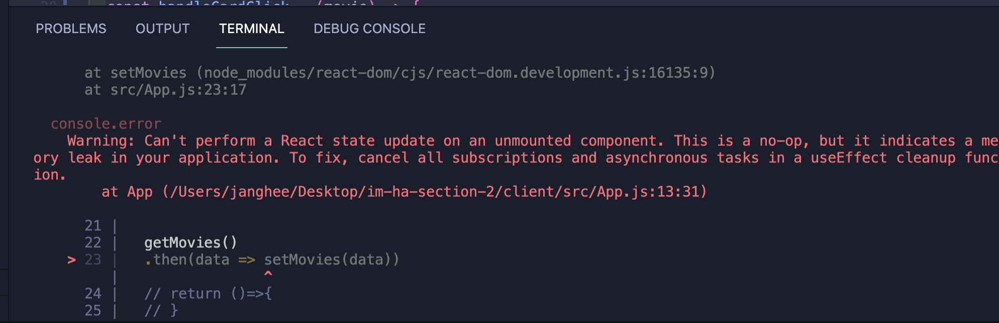
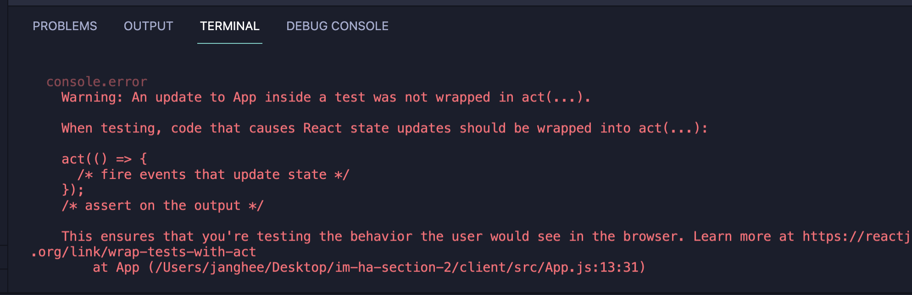

## ha2 에러
이번 ha2시험을 보면서 기능 테스트는 다통과했지만 터미널창에 에러가 나왔다 ㅠㅠ 내가 뜬 에러는 아래와 같다.(에러보다는 warning에 가깝다)

---



<br />

## 메모리 누수 에러
정말 많은 시간을 들여 왜 메모리 누수 에러가 나는지 많은 검색을 했고 cleanup function을 통해 해결 방법을 알게 되었다.

```js
Warning: Can't perform a React state update on an unmounted component.
This is a no-op, but it indicates a memory leak in your application.
To fix, cancel all subscriptions and asynchronous tasks in a useEffect cleanup function.

경고 : 마운트 해제 된 구성 요소에서 반응 상태 업데이트를 수행 할 수 없습니다. 
이것은 작동하지 않지만 응용 프로그램의 메모리 누수를 나타냅니다. 수정하려면 useEffect 
정리 기능에서 모든 구독 및 비동기 작업을 취소하십시오.
```

### 에러코드

```js
useEffect(()=> {
  getMovies()
  .then(data => setMovies(data))
  }, [currentMovie])
```

### 해결방법

아래와 같이 코드를 작성했더니 메모리 누수에러를 해결하였습니다. 전역변수를 설정 안해도 그냥 콜백함수를 리턴해도 해결이 가능했습니다 `return ()=>{}`

```js
useEffect(()=> {
  let mounted = true;
  getMovies()
  .then(data => setMovies(data))
  //cleanup function
  return ()=>{(mounted = false)
  }
  }, [])
  ```

useEffect가 실행될 때마다 지역변수 mounted 값을 true로 설정하고 clean-up function에 의해 false로 수정합니다. 즉, 컴포넌트가 ummounted 되어 mounted 값이 false일 때는 상태 업데이트가 이루어지지 않습니다. (비동기 작업이 완료 되지 않았을 때). 반대로 mounted 값이 true(비동기 작업이 완료)일 때 상태 업데이트가 진행됩니다. [참고링크](https://velog.io/@ksh4820/ErrorNote-Warning-Cant-perform-a-React-state-update-on-an-unmounted-component.-This-is-a-no-op-but-it-indicates-a-memory-leak-in-your-application.-To-fix-cancel-all-subscriptions-and-asynchronous-tasks-in-a-useEffect-cleanup-function)

<br />

이렇게 메모리 누수 경고는 해결했지만 여전이 `react-testing-library` 경고창이 뜬다 ㅠㅠ

---

## react-testing-library 에러



```js
컴포넌트의 진단을 준비하기 위해서는 컴포넌트를 렌더링하고 갱신해주는 코드를 act()를 호출한 것의 안에 넣어 줘야합니다. 이를 통해서 react를 브라우저 내에서 동작하는 것과 비슷한 환경에서 테스트를 할 수 있습니다.
```

### 해결방법

솔직히 자세히는 모르겠지만 원인은 useEffect 비동기에서 원인이 생긴거 같다. 그래서 [참고사이트](https://davidwcai.medium.com/react-testing-library-and-the-not-wrapped-in-act-errors-491a5629193b)를 참고해서 문제를 해결해보았다. 해결 방법은 `setTimeout()` 비동기 함수를 활용해서 경고메세지를 해결하였다 물론 전에 clean function을 사용하지 않아도 동시에 해결 할 수 있었다!

```js
useEffect(()=> {
  setTimeout(() => {
    getMovies()
  .then(data => setMovies(data))
  }, 500);
  }, [])
```

## 느낀점...

에러는 정말 나를 미치게 만든다... 앞으로 에러와 경고창들을 많이 겪게 될것이다... ㅠㅠ 그래도 뭔가 찾으면서 해결하는 재미도 쏠쏠하다! 다음은 어떤 에러를 마주할지 기대가 된다...