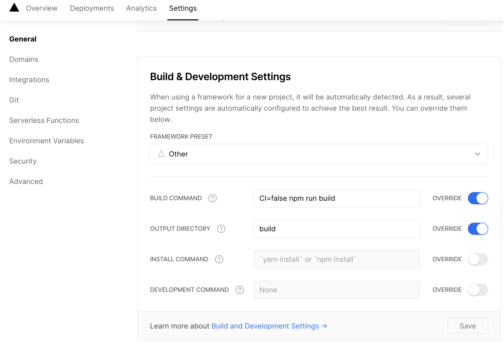

## vercel deploy error 배포 에러

---

배포를 하다가 `treating warnings as errors because process.env.ci = true. vercel` 오류가 떳다..


## 해결방법

Settings > General > Build & Development Settings <br />

```js
CI=false npm run build
```



