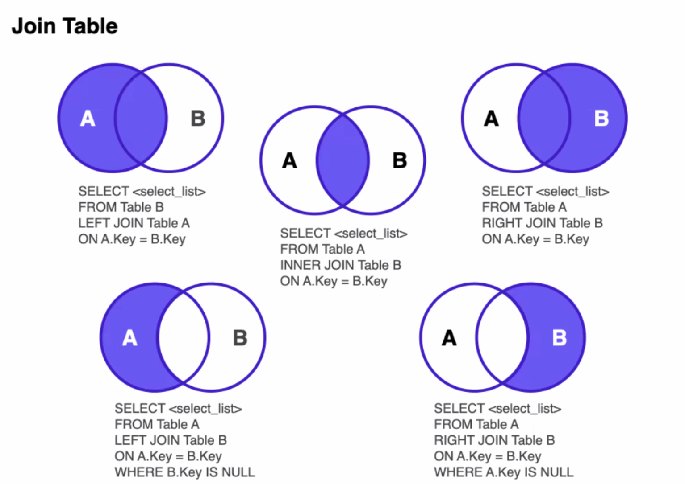

# MySQL_ JOIN

---

## JOIN

조인은 관계형 데이터 베이스에서 자주 쓰이면서 중요한 쿼리문중 하나입니다. 즉 각각의 테이블을 JOIN을 통해서 관계를 가질수 있게 합니다.

<br />

## INNER JOIN ON

아래는 INNER JOIN의 기본 구조입니다.

```
SELECT column_name(s)
FROM table1
INNER JOIN table2
ON table1.column_name = table2.column_name;
```

table1과 table2를 합친다란 뜻입니다. 중요한 부분은 ON입니다. ON은 관계의 기준을 말합니다. 즉 table1의 컬럼이름과 table2의 컬럼이름을 기준으로 관계를 형성하고 합친다 라는 뜻으로 이해하면 됩니다.

<br />

## JOIN image

아래 이미지는 JOIN에 대한 이미지입니다. 5가지가 있지만 순서만 바꿔서 해결할수 있기 때문에 왼쪽 3개만 알아도 충분히 JOIN문을 사용할수 있습니다.

