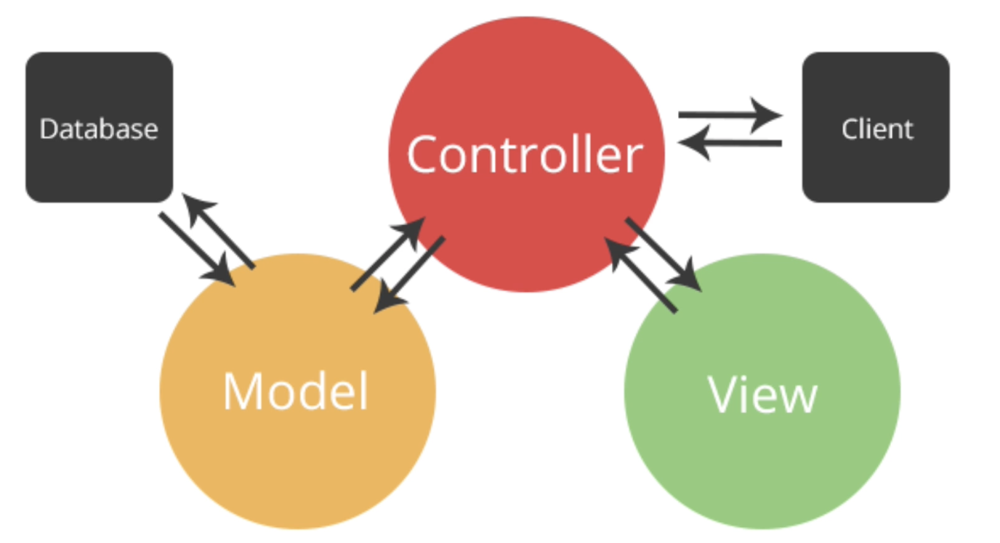
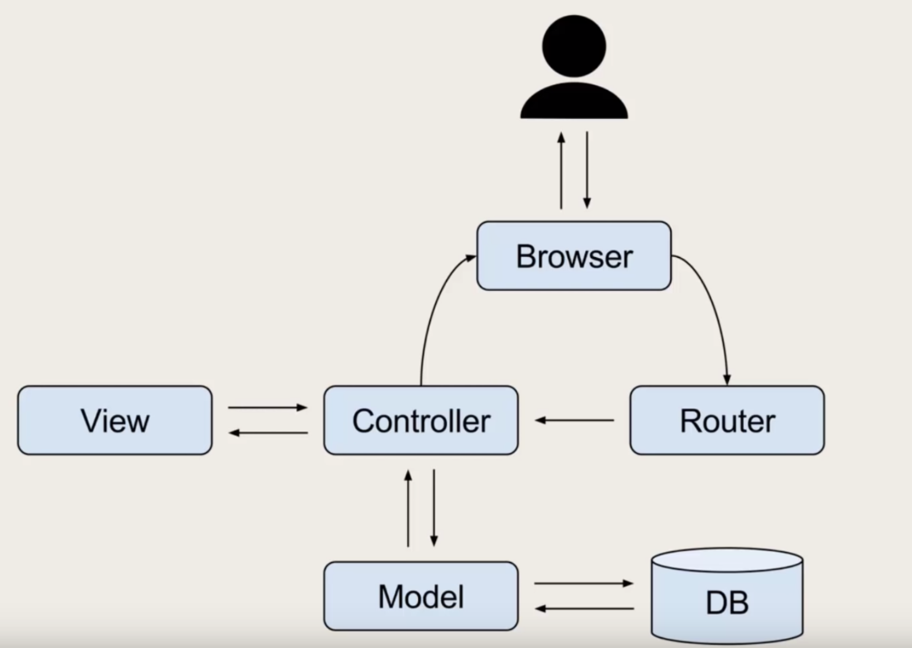
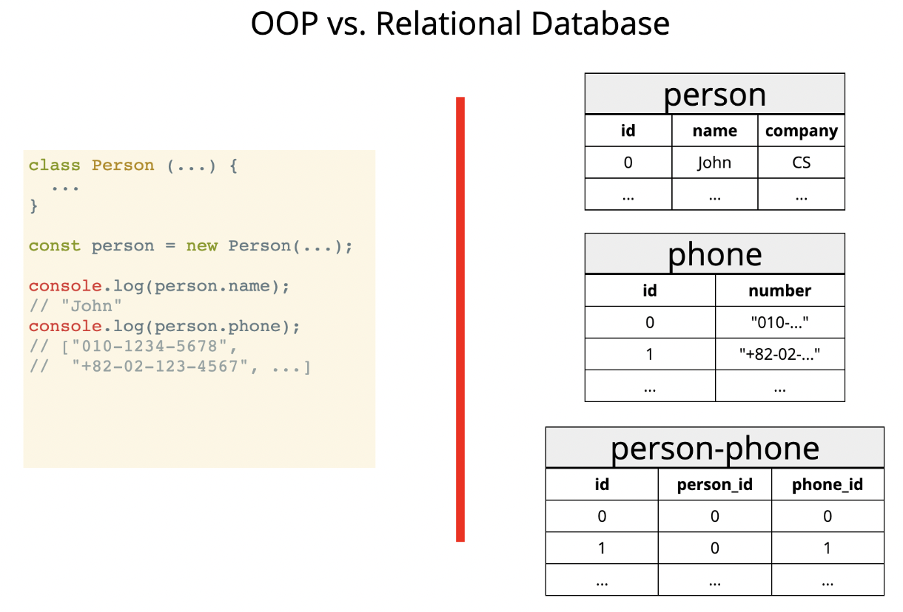

# ORM & MVC design pattern

---

## MVC

Model, View, Controller의 약자로 하나의 소프트웨어 아키텍쳐 디자인 패턴입니다. 또한 처리들을 기능별로 나눠서 처리하는 특징이 있습니다. 일종의 의도된 코드드를 다룰수 있으며 코드 가독성, 관리성, 퀄리티가 매우 좋습니다.



<br />

## 모델(Model)

테이터베이스와 연결이 되어 있어서 데이터의 정보를 다룰수 있습니다. 또한 이러한 데이터를 Controller와 상호 작용합니다.

<br />

## 뷰(View)

유저가 보는 화면을 보여주는 역할을 합니다. Controller와 상호작용을 합니다.

<br />

## 컨트룰러(Controller)

뷰에서 일어난 액션과 이벤트에 대한 인풋값을 받습니다. 또한 데이터를 가공해서 모델에게 넘겨주거나 모델로부터 가공된 데이터를 얻습니다. 그리고 뷰가 사용자에게 보여주기 쉽도록 가공된 데이터를 넘겨줍니다.



<br />

## ORM

Object-Relational Mapping 약자로 관계형 데이터를 자바스크립트로 쉽게 다룰수 있도록 도와주는 역할을 합니다. 또 한 쉽게 접근할수 있고 관리와 가독성이 매우 좋습니다.

<br />



<br />

```js
// sequelize ORM 예시코드
var Sequelize = require('sequelize');
var db = new Sequelize('chatter', 'root', '');
 
var User = db.define('User', {
  username: Sequelize.STRING
});
 
var Message = db.define('Message', {
  userid: Sequelize.INTEGER,
  text: Sequelize.STRING,
  roomname: Sequelize.STRING
});
 
User.sync()
  .then(function() {
    return User.create({username: 'Jean Valjean'});
  })
  .then(function() {
    return User.findAll({ where: {username: 'Jean Valjean'} });
  })
  .then(function(users) {
    users.forEach(function(user) {
      console.log(user.username + ' exists');
    });
    db.close();
  })
  .catch(function(err) {
    console.error(err);
    db.close();
  });
```
