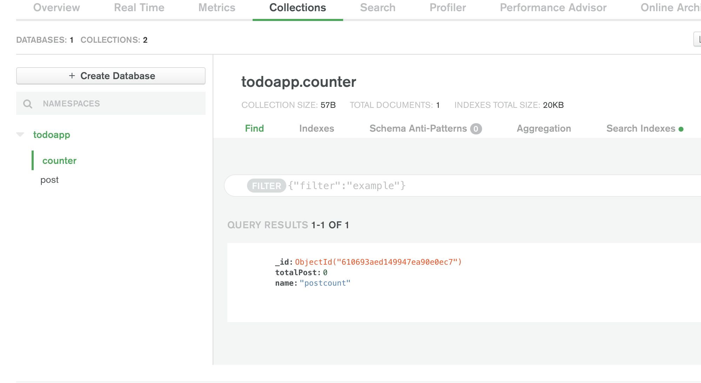

## DB_Update (숫자 업데이트 하기)

몽고db에 테이터를 저장할 땐 _id라는 값을 꼭 넣어야 합니다. 그래야 나중에 삭제 및 수정이 수월합니다. 여튼 아까 짠 코드에 데이터 수를 업데이트 하기 위해서 몽고db 홈페이지에 들어가서 대시보드에서 collection을 하나 더 추가합니다.



우측에 insert Document 버튼을 눌러 위와 같이 기능을 추가합니다. (숫자니까 int32 셋팅)  
위에 셋팅한 값들은 지금까지 몇번 게시물을 방행했는지 기록하는 공간입니다.

<br />

## update 코드 

updateOne({어떤 자료},{수정 하고 싶은 내용},(콜백함수)=>{업뎃후 할일})

```js
app.post('/add',(req,res)=>{
        res.send('전송완료')
        console.log(req.body.title)
        console.log(req.body.date)

        // counter라는 콜랙션에 name이 postcount이라는 자료를 찾습니다.
        // findOne()은 어떤 한가지의 자료를 찾을 때 쓰는 메서드입니다.
        db.collection('counter').findOne({name:'postcount'}, (err,result)=>{
            console.log(result.totalPost)
            let totalNum = result.totalPost

        // post라는 컬렉션에 아이디, 제목, 날짜 추가하기
        // insertOne은 자료를 추가하는 메서드입니다.
        db.collection('post').insertOne({_id : totalNum + 1, 제목:req.body.title, 날짜:req.body.date},(err,result)=>{
            console.log('저장완료')
            // counter라는 콜렉션에 있는 totalpost 항목도 1증가 해야됨
            // counter라는 컬렉션에서 name이 postcount의 자료에 있는 totalPost에 있는 수를 1씩 증가시켜 업뎃합니다.
            db.collection('counter').updateOne({name:"postcount"},{$inc:{totalPost:1}},(err,result)=>{
                if(err){return console.log(err)}
            })

          });
       })
    });
```

{$set : {totalPost:100}} 이렇게 하면 100으로 변경해달라는 뜻  
{$inc : {totalPost:5}} 이렇게 하면 5씩 증가해라는 뜻  

$ 표시 붙은게 operator 문법입니다.