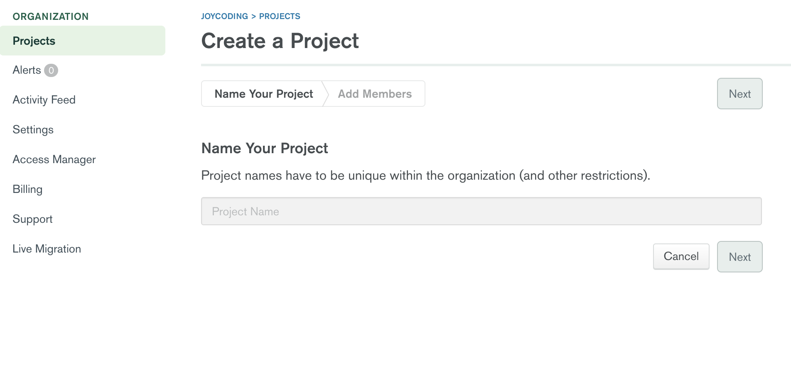
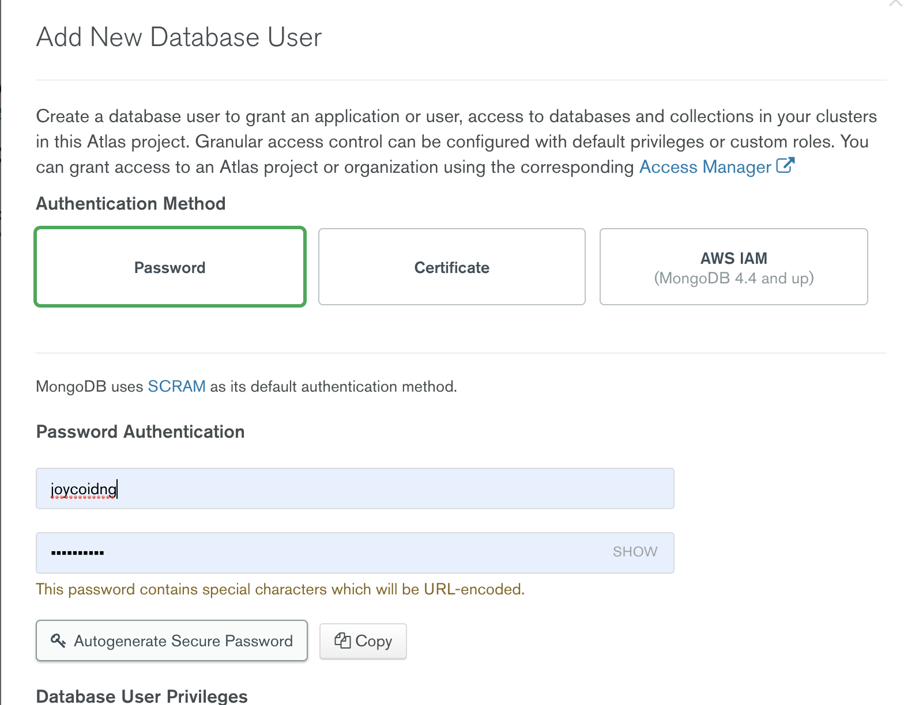
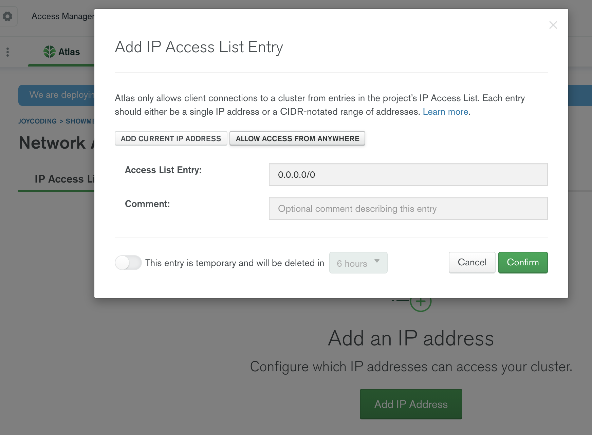
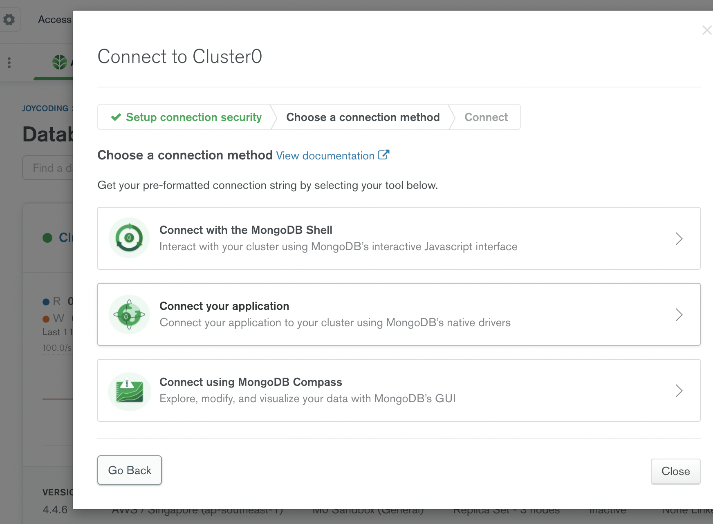
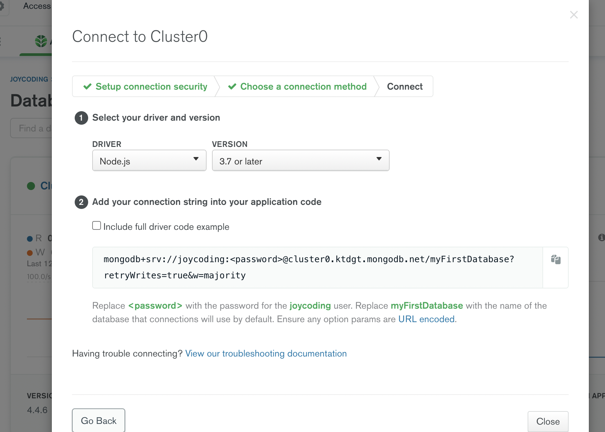

## mongoDB Atlas가입 및 세팅

---

## #1 구글에 Mongodb atlas라고 검색해서 홈페이지 방문

방문해서 MongoDB 가입을 합니다.

<br />

## #2 프로잭트 파일 만들기

새로운 프로잭트 파일을 만듭니다.



<br />

## #3 Cluster 생성하기

맨오른쪽 무료버전 Cluster 하나를 생성합니다.


<br />

## #4 서버위치 선택

서버위치는 한국가 가까운 싱가포르를 선택해줍니다. 나머지는 안건드려도 됩니다.


<br />

## #5 계정만들기

데이터베이스 접속할 할 수 있는 아이디/비번을 만들어 줍니다.




<br />

## #6 Network Access 메뉴에서 IP추가

데이터베이스 접속할 수 있는 IP를 미리 정의해놓는 일종의 보안장치입니다. 0.0.0.0/0을 추가합니다.



<br />

## #7 connect하기

Database에서 connect버튼을 클릭하고 connect your application을 클릭하고 해당 코드를 복사합니다.





<br />

## #8 몽고디비 설치하기

터미널에에서 몽고디비 라이브러리를 설치합니다.

```js
npm i mongodb  

// 에러가 나면 아래와 같이
npm i mongodb@3.6.4
```

<br />

## #9 복사한 코드 붙이기

몽고디비를 설치 후 아까 7번 단계에서 복사한 코드를 아래와 같이 붙입니다.


```js
const express = require('express');
const app = express();

const MongoClient = require('mongodb').MongoClient; //몽고디비 사용

MongoClient.connect('mongodb+srv://joycoding:<password>@cluster0.ktdgt.mongodb.net/myFirstDatabase?retryWrites=true&w=majority',(err,client)=>{

    app.listen(8080,()=>{
        console.log('hello joycoding!')
    });

})
```