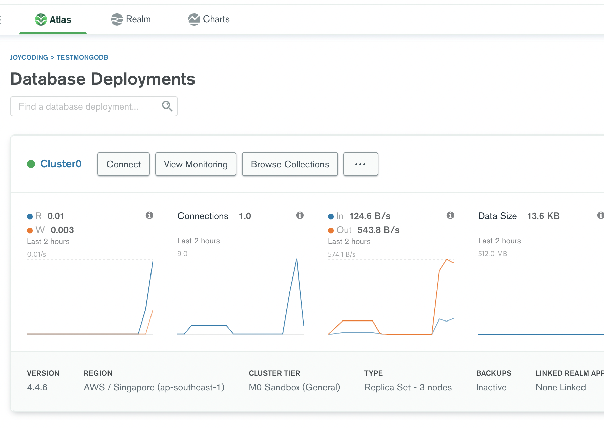
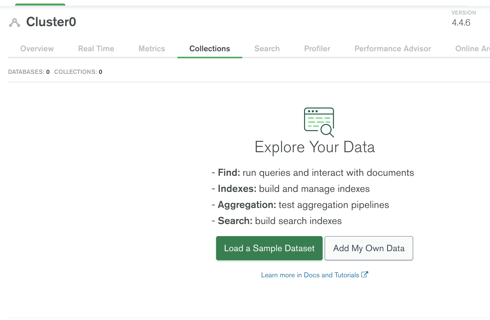
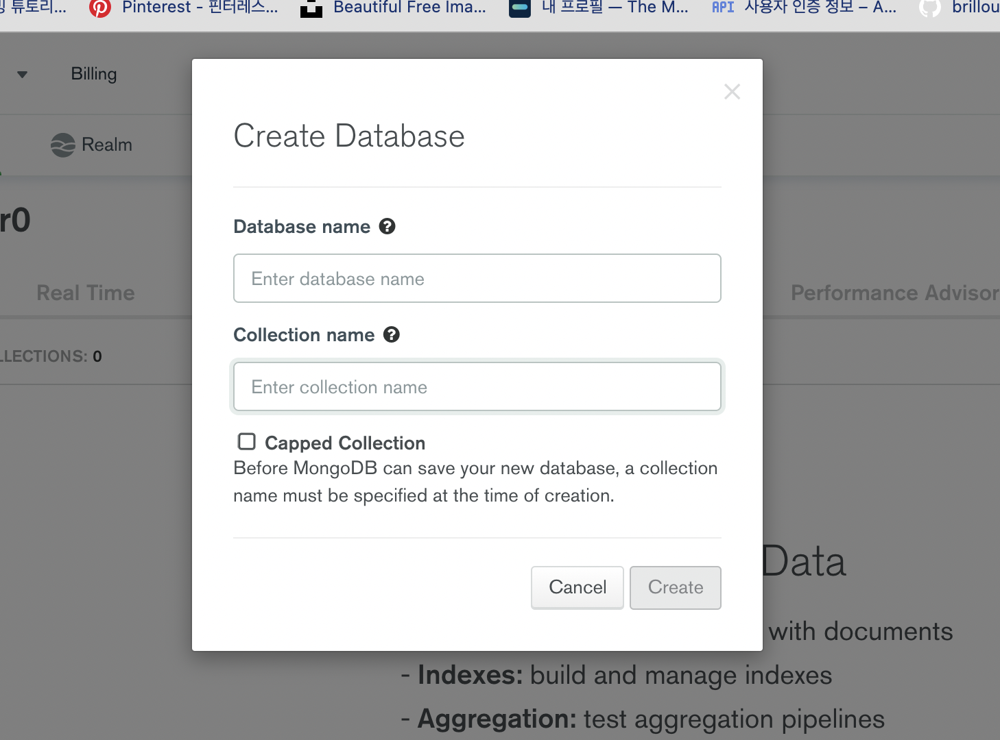
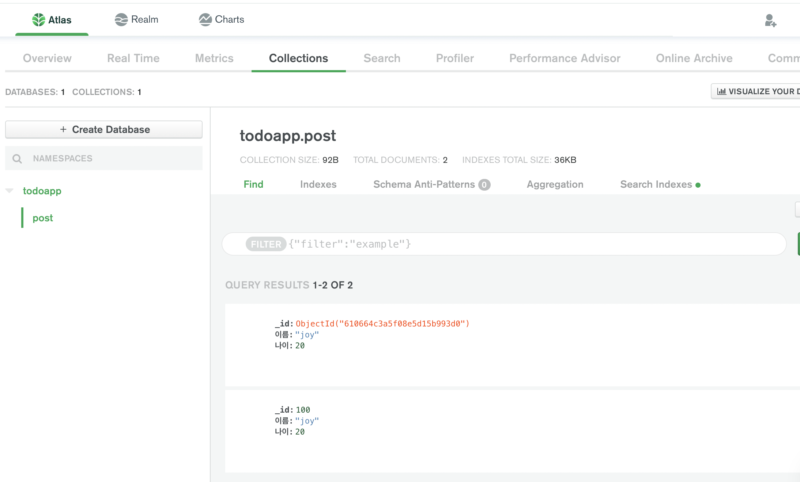

## Browse collections 클릭하기

Browse collections클릭해서 들어가면 컬렉션 데이터를 추가할수 있는 페이지가 있습니다. 여기서 add my own data 클릭합니다. 





<br />

## database & collection 이름 생성

데이터 베이스와 컬렉션의 이름을 만듭니다.



<br />

## 데이터 자료 추가하기 

전역변수로 db를 생성해주고 `db=client.db('데이터베이스이름')`해서 몽고디비에 접속을 합니다. 또한 db.collection('post').insertOne({추가할 자료},(콜백함수) 작성해서 자료를 추가합니다.

```js
const express = require('express');
const app = express();

//몽고디비 사용
const MongoClient = require('mongodb').MongoClient;

var db; // 페이지 전체에서 쓸 수 있는 전역 변수 설정
MongoClient.connect('mongodb+srv://joycoding:<password>@cluster0.ktdgt.mongodb.net/myFirstDatabase?retryWrites=true&w=majority',(err,client)=>{
    // 연결되면 할일
    if(err) return console.log(err)

    // todoapp 이라는 database에 접속해주세요
    db = client.db('todoapp') 

    // db.collection('post')는 콜랙션중 post를 선택한다는 뜻입니다.
    // insertOne을 붙이면 자료를 추가할수 있습니다 (Object 자료 형식)
    // insertOne(추가할자료, 콜백함수)
    // 패턴 확실하게 외우기 // 추가할때마다 아래 코드 작성하면 됨
    db.collection('post').insertOne({이름:'joy', _id:100, 나이:20},(err,result)=>{
        console.log('저장완료')
    });

    app.listen(8080,()=>{
        console.log('hello joycoding!')
    });

})
```

<br />

## 데이터 자료 확인하기 

아래와 같이 추가된 데이터를 확인할수 있습니다.



<br />

## _id는 무엇?

mongoDB에선 자료들을 서로 구분하기 위해 _id가 꼭 있어야 합니다. 일종의 출석번호 입니다. 이걸 직접 작성하지 않으면 자동으로 유니크한 아이디를 부여해줍니다. 하지만 이상한 문자들로 구성되어 있으니 직접 작성하는것을 권장합니다.