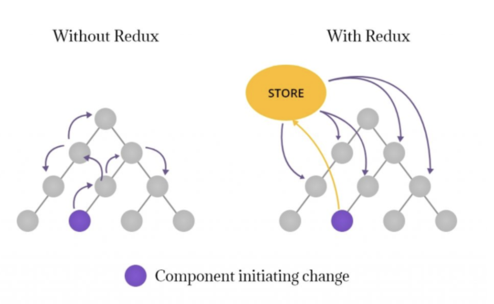
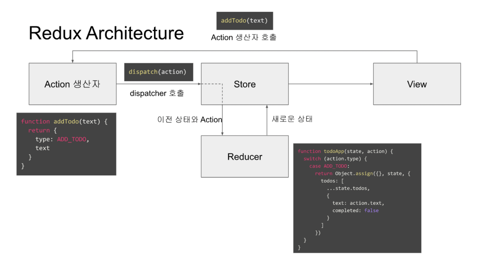
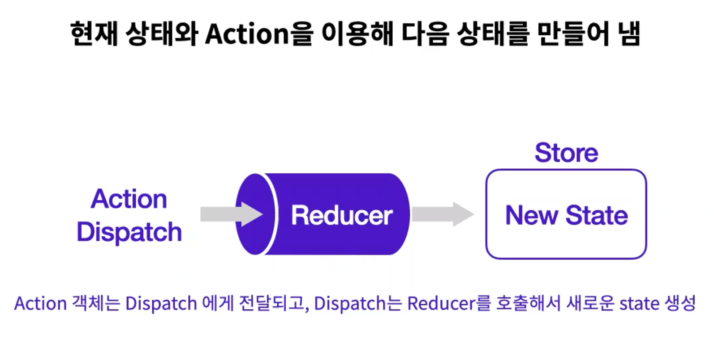
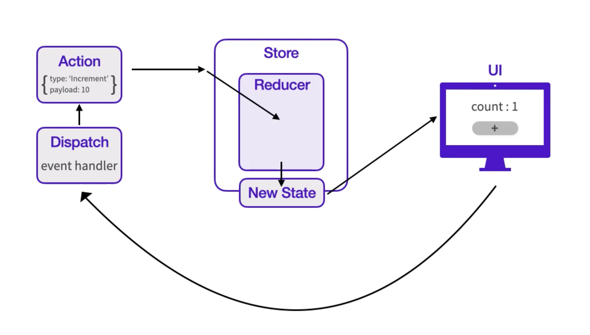

## Redux

---

리덕스는 상태관리를 효율적으로 도와주는 라이브러리 입니다. 웹, 앱 어플리케이션의 상태들이 많아지고 **복잡성이 늘어남에 따라 보다 효율적이고 안정적인 상태 관리를 위해 리덕스와 같은 상태 관리 라이브러리를 사용**합니다! npm트렌드 동향에 따르면 리덕스는 가장 높은 사용률을 가지고 있습니다! 그리고 리덕스는 리엑트를 위한 라이브러리라고 착각하지만 자바스크립트 환경이라면 사용 가능한 라이브러리 입니다!
<br />

## Redux를 사용하는 이유

---

<br />


<br />

리엑트는 상위 컴포넌트에서 하위 컴포넌트로 단방향 흐름으로 상태를 전달 시키는 구조로 되어 있습니다! 만약 위의 사진처럼 복잡해진 컴포넌트 관계 속에서 상태를 변화 시켜 주려한다면 왼쪽 모양처럼 올라가고 내려가고 많은 컴포넌트를 거쳐 원하는 컴포넌트에 상태를 전달 시켜줍니다. 

**하지만 이과정은 상위 컴포넌트가 리렌더링 된다면 그 자식 컴포넌트들도 불필요한 리렌더링이 발생**하기 때문에 이러한 문제를 개선하기 위해 리덕스를 사용하게 됩니다. 또한 **리덕스는 하나의 스토어에 저장하고 불러오며 불필요하게 상태를 다른 컴포넌트에 전달 시킬 이유가 사라지고** 단계 별로 파일을 만들어 관리하기 때문에 관리의 효율성과 직관적인 코드를 작성하는데 유용합니다!

<br />

## 이미지로 보는 Redux 아키택쳐 & Overview

---

<br />


<br />


<br />


<br />


## Redux 3원칙

---

### 1. 애플리케이션 상태는 모두 한 곳에서 관리 됩니다. (단일 진실 공급원 원칙)<br />
- 하나의 어플리케이션에선 단 한개의 스토어를 만들어서 사용합니다. 여러개의 스토어를 사용하는 것은 사실 가능하기는 하지만 권장하지 않습니다! (개발도구를 활용할수 없습니다)<br />

### 2. 상태는 불변(읽기 전용)데이터이며, 오직 액션만이 상태 교체를 요청할 수 있습니다.<br />
- 배열을 업데이트 해야 할 때는 배열 자체에 push를 하지 않고, concat같은 함수를 사용하여 기존의 배열은 수정하지 않고 **새로운 배열을 만들어서 교체하는 방식으로 업데이트**를 해야 합니다. 객체 업데이트도 마찬가지로, 기존의 객체는 건드리지 않고 **얕은복사 Object.assign을 사용하거나 spread연산자를 사용해서 업데이트** 합니다.<br />

### 3. 리듀서(순수함수)를 통해 상태의 최종 값만 설정합니다.<br />
- 리듀서 함수는 이전 상태와, 액션 객체를 파라미터로 받습니다.<br />
- 동일한 인자값을 받으면 동일한 리턴값을 반환합니다.<br />
- 외부에 영향을 주지도 받지도 말아야 합니다.<br />
- 어디서 호출되든 동일한 결과를 보여줘야 합니다.<br />
<br />

## Redux의 keyword 정리

---

### 액션(Action)
상태에 변화가 필요할 때 저장소(Store)로 데이터를 보내기 위한 작업을 액션이라고 부릅니다. 액션은 하나의 객체로 구성되어 있고 그 안에는 **필수적으로 Type이라는 필드**를 가지고 있어야 합니다. 
<br />

```js
{
    type: "JOYCODING_ADD",
}
```
<br />
액션 객체는 `tpye`필드를 필수적으로 가지고 있어야 합니다. 그외의 값들은 맘대로 하면 됩니다.  
<br />

```js
{
  type: "JOYCODING_TODO",
  data: {
    id: 0,
    text: "리덕스 배우기"
  }
}
```

```js
{
  type: "JOYCODING_INPUT",
  text: "안녕하세요"
}
```
<br />

### 액션 생성함수(Action Creator)
액션 생성함수는 , 말그대로 액션을 만드는 함수 입니다.  
<br />

```js
export function addTodo(data) {
  return {
  type: "JOYCODING_TODO", 
  data: {
    id: 0,
    text: "리덕스 배우기" 
   }
}
```
<br />

### 스토어(Store)
스토어는 리덕스를 관리하는 하나의 저장소이며 단 하나의 스토어를 가지는 것이 원칙입니다. 스토어 안에는 현재의 상태와 리듀서 함수 그리고 몇 가지 내장 함수들이 있습니다.  
<br />

 
### 디스패치(dispatch)
디스패치는 스토어의 내장함수 중 하나입니다. 디스패치가 액션을 발생 시켜 스토어에게 상태 변화가 필요하다는 것을 알려줍니다. 이때 스토어는 전달 받은 액션을 가지고 리듀서 함수를 실행합니다.  
디스패치라는 함수에는 **액션을 파라미터로 전달하고 호출하면 스토어는 리듀서 함수를 실행시켜 액션을 참고하여 새로운 상태를 만들어 줍니다.**  
<br />
 

### 구독(subscribe)
구독은 함수를 전달 받아 디스패치 되었을 때 마다 함수를 실행시켜 주는 스토어의 내장 함수입니다. 이때 함수에는 리듀서에 의해 변한 데이터를 전달시켜 줍니다.  
<br />


### 리듀서(Reducer)
리듀서는 상태 변화를 일으키는 함수입니다. 리듀서는 현재의 상태와 액션으로 두가지의 파라미터를 전달 받습니다. **전달 받은 현재 상태와 액션을 참고하여 새로운 상태를 만들어 반환**합니다.   
<br />

```js
const reducer = (state, action) => {
    swich(action.type){
        case 'ADD':
            return state += 1
        default:
            return state
    }
}
```
<br />

리듀서는 보통 swich문을 이용해 액션 타입에 맞는 로직을 작성합니다. 또한 **리듀서에서는 default: 부분에기존 state를 그대로 반환하도록 작성**해야 합니다.