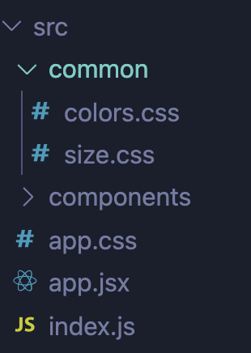

# 공통적인 css 분류하기

---


## 공통적으로 관리할 폴더 만들어 주기

---

대충 common이라는 폴더를 만들어서 css를 관리할 파일을 만들어 줍니다. 예를들어 색상과 사이즈를 관리 하고 싶으면 아래와 같이 만들어 줍니다.



<br >

## 색상 및 사이즈 정의

---

해당 파일에 가서 각각 정의하고 싶은 색상이나 사이즈를 정의합니다. 변수를 지정할때는 `@value 변수명:지정값`으로 설정하면 됩니다. 

```js
//colors.css
@value makerBlack: black;
@value makerWhite: white;
@value makerLightGrey: #e8e7e6;
@value makerLightPink: #ffeae8;
@value makerGrey: #626262;
@value makerGreen: #385461;


//size.css
@value mediaQuery: 58rem;
```


## index.css에서 설정하기

---

주의할점은! postcss를 사용하려면 index.css파일 이름을 index.module.css로 변경해야 합니다. 그렇게 한다음 설정한 css경로를 찾아 import해서 사용하면 됩니다.

```js
//index.module.css
@value makerGreen from './common/colors.css'; //불러오기


body {
  margin: 0;
  font-family: -apple-system, BlinkMacSystemFont, 'Segoe UI', 'Roboto', 'Oxygen',
    'Ubuntu', 'Cantarell', 'Fira Sans', 'Droid Sans', 'Helvetica Neue',
    sans-serif;
  -webkit-font-smoothing: antialiased;
  -moz-osx-font-smoothing: grayscale;
  background-color: makerGreen;  //작성
}

code {
  font-family: source-code-pro, Menlo, Monaco, Consolas, 'Courier New',
    monospace;
}
```
<br />

# index.js도 바꿔 주기!

---

위에 파일명을 수정하였기 때문에 index.js에서도 파일명을 수정해줍니다!

```js
//index.js
import React from 'react';
import ReactDOM from 'react-dom';
import './index.module.css'; // 모듈로 수정하기
import App from './app';

ReactDOM.render(
  <React.StrictMode>
    <App />
  </React.StrictMode>,
  document.getElementById('root')
);
```