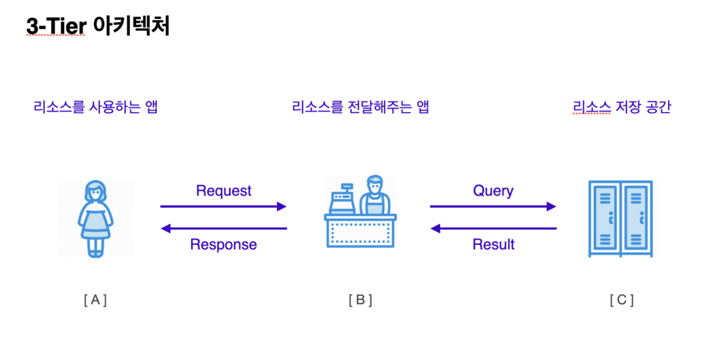
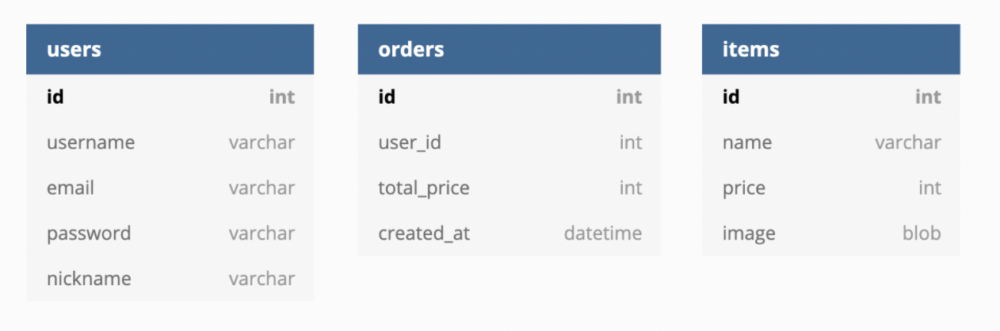

# 데이터베이스_cheakpoint

---

## #1. 3-Tier 아키텍처란



<br />

### 클라이언트 -> 서버 -> 데이터베이스 -> 서버 -> 클라이언트

1. 클라이언트는 서버에게 데이터 자료를 요청합니다. 
2. 클라이언트로부터 데이터 자료를 요청받은 서버는 데이터베이스에게 쿼리형식으로 다시 요청합니다.
3. 데이터베이스는 요청받은 데이터 결과를 서버에 전송합니다. 
4. 서버는 요청한 자료를 클라이언트에게 응답합니다.

<br />

## #2. 관계형데이터베이스(SQL) 특징

1. 데이터베이스는 테이블로 구성되어 있고 테이블 안에는 행과 열로 구성되어 있습니다.
2. SQL은 create, read, update, delete 모두 가능합니다.
3. 대표적인 관계형 데이터 베이스로는 MySQL, SQLite, Postgres, MariaDB가 있습니다.
4. SQL을 사용하려면 형식이 고정된 스키마가 필요합니다. 즉 데이터의 형식을 미리 잘 설정해야 원하는 데이터에 대한 작업이 수월하게 작업할수 있습니다.

<br />

## #3. Primary Key와 Foreign Key 이해

1. Primary Key란 관계형 데이터베이스 테이블의 각 레코드를 고유하게 식별하는 속성입니다
2. Primary Key는 테이블 내에 다수의 컬럼에 부여할 수는 있으나 각각 유니크한 값을 가져야합니다.
3. FOREIGN KEY는 다른 테이블을 참조하는 목적으로 사용됩니다.
4. REFERENCES 라고 하는 SQL을 사용해서 FOREIGN KEY로 다른 테이블과 관계를 형성합니다.

<br />

## #4. 데이터베이스 관계 이해



1. user테이블과 orders테이블의 관계는 1:N입니다. 
- 한명의 유저는 주문을 여러번 할수 있지만 여러번의 주문이 한명이 될수는 없습니다.

2. orders테이블과 items의 관계는 N:M입니다.
- 주문은 여러개의 상품을 주문 할수 있으며 상품도 여러번 주문할수 있기때문에 다:다 관계입니다.

<br />

## #5. 쿼리문 inner join 이해


<br />

김코딩의 아이디와 주문액의 합계를 가져오기 

```
select orders.id, orders.total_price from orders
inner join users on users.id = orders.user_id 
where users.username = "김코딩";
```

1. (select, from) 사용해서 orders테이블로 부터 주문아이디와 주문총액을 가져옵니다.  
2. inner join은 교집합 즉 orders테이블과 users테이블의 아이디 값을 합친다는 뜻입니다.
3. where구문을 활용해서 테이블에서 유저네임이 김코딩인 것을 찾습니다.  


<br />

## #6. NoSQL 특징

1. NoSQL은 수평적 확장이며 비교적 SQL보다 확장성이나 속도면서 뛰어나고 비용도 저렴합니다.
2. NoSQL은 형식이 정해지지 않아 유연하게 데이터를 저장할 수 있습니다.
3. 데이터 구조를 자주 업데이트 해야하는 경우 NoSQL 기반의 비관계형 데이터베이스가 적합합니다.
4. 데이터베이스의 ACID 성질을 철저하게 지켜야 하는 경우에는 적합하지 않을 수 있습니다.

<br />

## #7. SQL vs. NoSQL 비교 이해

1. 항상 일관된 데이터가 필요한 앱 (e.g. 주식거래)
- 데이터베이스에서 ACID라는 특징이 있습니다. (A는 원자성, C일관성, I격리성, D지속성) SQL에서 테이터베이스의 상태는 이전과 같이 유효해야하기떄문에 일관적이여야 합니다.

2. 많은 수의 읽기, 쓰기 작업이 동시에 처리되고 시스템의 확장성이 빠른 앱 (e.g. 소셜 미디어)
- 대용량 처리와 동시처리가 가능하고 시스템의 확정성이 빠른 앱은 noSQL에 적합합니다.

3. 기능별로 복잡한 관계가 많이 설정되는 앱 (e.g. 쇼핑몰)
- 복잡한 관계를 이어주는 스키마를 생각하면 됩니다.