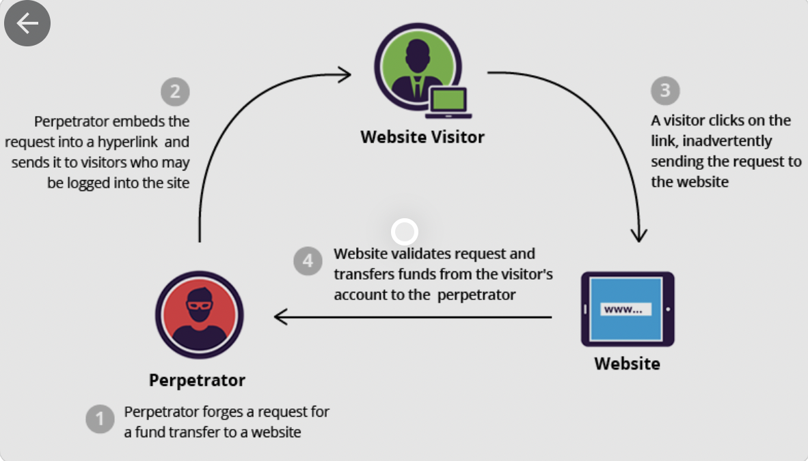

# CSRF

---

### web application security란  
개발자들이 웹사이트, 모바일 어플, 웹 api 등을 만들 때에 해커들의 공격을 막기 위한 보안이다. 보안을 공격하는 SQL injection, XSS, CSRF가 있습니다. 대표적으로 CSRF를 활용해서 정보를 터는 경우가 많습니다.

 

## CSRF란

cross site request forgery의 약자로 악성 스크립트가 담긴 사이트를 열거나 링크를 클릭할 때, 변조된 요청을 보내는 공격입니다. 기존의 로그인한 기록을 바탕으로 서버가 클라이언트의 요청을 믿기 때문에 발생합니다. 다른 오리진에서 유저가 보내는 요청을 조작하는 것입니다. (해커가 직접 데이터를 접근할 순 없습니다.)

 

### 공격을 하기 위한 조건

1. 쿠키를 사용한 로그인
- 유저가 로그인 했을때, 쿠키로 어떤 유저인지 알 수 있어야 합니다.  

2. 예측할 수 있는 요청 /parameter를 가지고 있어야 함
- request에 해커가 모를 수 있는 정보가 담겨 있으면 안됩니다.

 

 

## 예방 방법

1. CSRF 토큰 사용하기
- 서버측에서 CSRF 공격에 보호하기 위한 문자열을 유저의 브라우저와 웹 앱에만 제공

2. same-site cookie 사용하기
- 같은 도메인에서만 세션/쿠키를 사용할 수 있다.

3. 사용하지 않을때 로그아웃하기