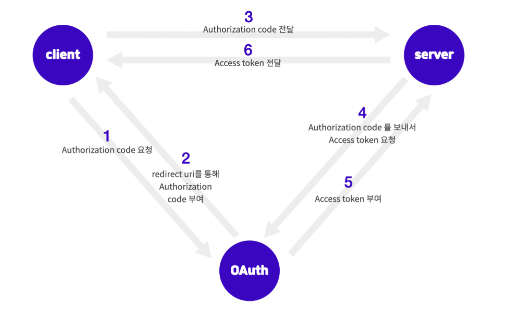
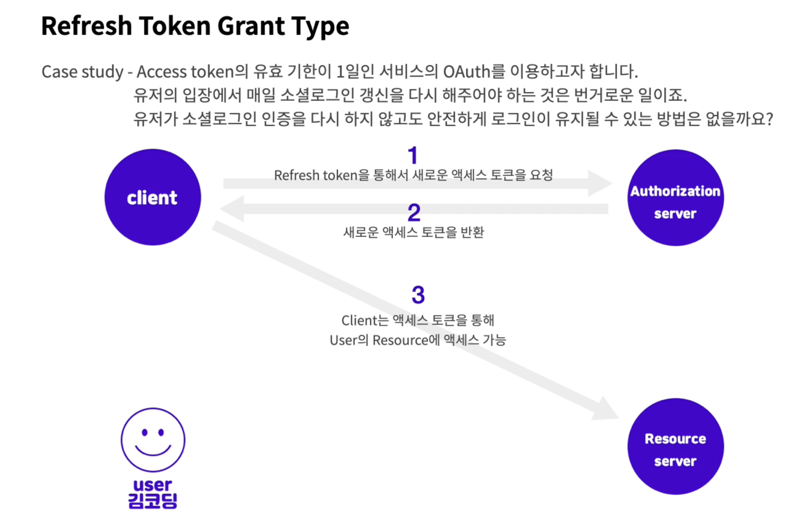
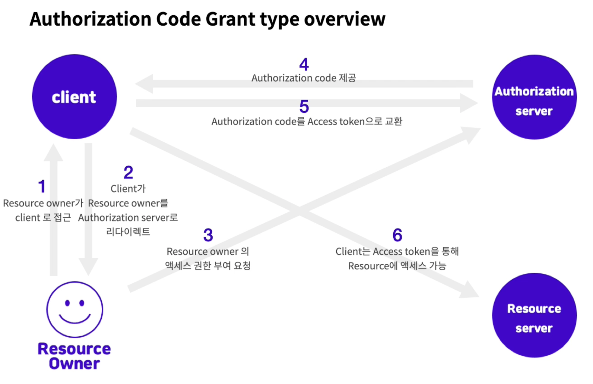
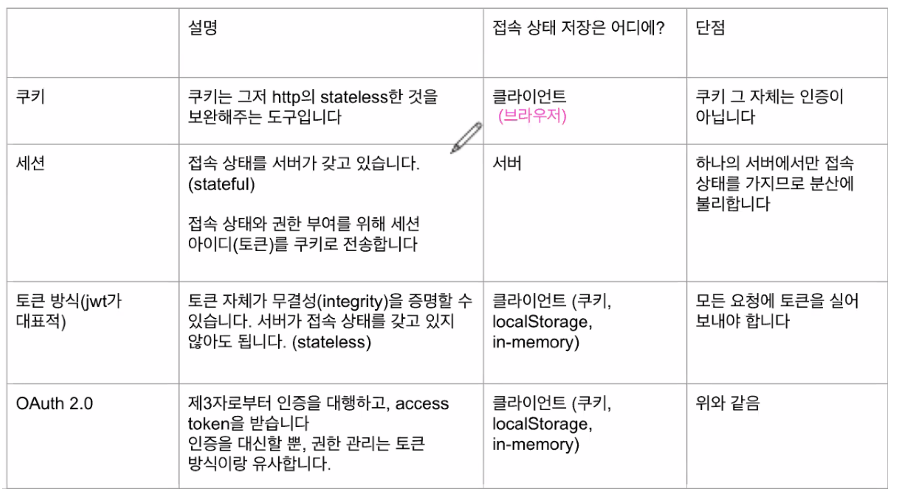

## Oauth 2.0

전통적으로 직접 작성한 서버에서 인증을 처리해주는 것과는 달리, OAuth는 인증을 중개해주는 메커니즘입니다. 보안된 리소스에 액세스하기 위해 클라이언트에게 권한을 제공하는 프로세스를 단순화하는 프로토콜입니다.
즉, 이미 사용자 정보를 가지고 있는 웹 서비스(GitHub, google, facebook 등)에서 사용자의 인증을 대신해주고, 접근 권한에 대한 토큰을 발급한 후, 이를 이용해 내 서버에서 인증이 가능해집니다.

 

요약하자면 OAuth2.0은 인증을 위한 표준 프로토콜의 한 종류이며 보안 된 리소스에 액세스하기 위해 클라이언트에게 권한을 제공(Authorization)하는 프로세스를 단순화하는 프로토콜 중 한 방법입니다.

 

## Oauth 쓰는 이유

OAuth는 보안상의 이점도 있습니다.  검증되지 않은 App에서 OAuth를 사용하여 로그인한다면, 직접 유저의 민감한 정보가 App에 노출될 일이 없고 인증 권한에 대한 허가를 미리 유저에게 구해야 하기 때문에 더 안전하게 사용할 수 있습니다.

 

## Oauth 필수 용어

1. Resource Owner 
- 액세스 중인 리소스의 유저입니다. 김코딩의 구글 계정을 이용하여 App에 로그인할 경우, 이때 Resource owner은 김코딩이 됩니다.

 

2. Client 
- Resource owner를 대신하여 보호된 리소스에 액세스하는 응용프로그램입니다. 클라이언트는 서버, 데스크탑, 모바일 또는 기타 장치에서 호스팅할 수 있습니다.

 

3. Resource server 
- client의 요청을 수락하고 응답할 수 있는 서버입니다.

 

4. Authorization server 
- Resource server가 액세스 토큰을 발급받는 서버입니다. 즉 클라이언트 및 리소스 소유자를 성공적으로 인증한 후 액세스 토큰을 발급하는 서버를 말합니다.

 

5. Authorization grant 
- 클라이언트가 액세스 토큰을 얻을 때 사용하는 자격 증명의 유형입니다.

 

6. Authorization code
- access token을 발급받기 전에 필요한 code 입니다. client ID로 이 code를 받아온 후, client secret과 code를 이용해 Access token 을 받아옵니다.

 

7. Access token 
- 보호된 리소스에 액세스하는 데 사용되는 credentials입니다. Authorization code와 client secret을 이용해 받아온 이 Access token으로 이제 resource server에 접근을 할 수 있습니다.

 

8. Scope
- scope는 토큰의 권한을 정의합니다. 주어진 액세스 토큰을 사용하여 액세스할 수 있는 리소스의 범위입니다.

 

## 로직 플로우

 

## Oauth 종류

### Grant type 

클라이언트가 엑세스 토큰을 얻는 방법입니다.

 

1. Authorization code grant type

액세스 토큰을 받아오기 위해서 먼저 Authorization code를 받아 액세스 토큰과 교환하는 방법

 

 

Authorization code 절차를 거치는 이유는 보안성 강화에 목적이 있습니다.  
client에서 client-secret을 공유하고 액세스 토큰을 가지고 오는 것은 탈위될 위험이 있기 때문에 client에서는 Authorization code만 받아 오고 server에서 access token 요청하면 됩니다.

 

2. refresh token grant type 

일정 기간 유효 시간이 지나서 만료된 액세스 토큰을 편리하게 다시 받아오기 위해 사용하는 방법

 

 

access보다 refresh token의 유효 시간이 조금더 길게 설정하기 때문에 가능한 방법이다.  
server마다 refresh토큰에 대한 정책이 다르기 때문에 서버의 정책을 살펴볼 필요가 있습니다.(사용자체가 안될 수 있음)

 

## 세션,토큰,오어쓰 비교표

