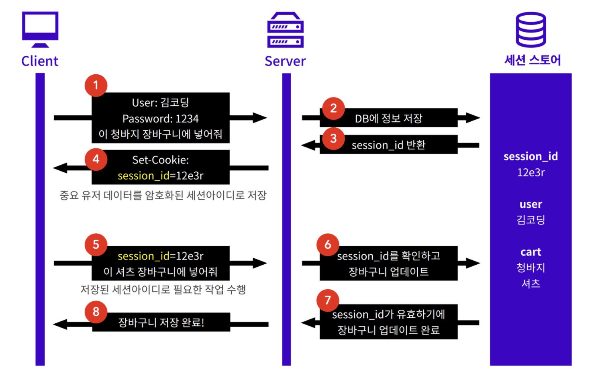

## 세션이란?

1. http session id를 식별자로 구별하여 데이터를 사용자의 브라우저에 쿠키형태가 아닌 접속한 서버 DB에 정보를 저장한다.
2. 클라이언트는 HTTP Session id를 쿠키로 메모리 저장된 형태로 가지고 있다.
3. 메모리에 저장하기 때문에 브라우저가 종료되면 사라지게 된다.

 

## 중요 point

- 서버가 클라이언트에 유일하고 암호화된 ID부여
- 중요 데이터는 서버에서 관리
- 신뢰할 수 있는 유저인지 확인이 가능
- 쿠키에 세션 아이디가 저장

 

## 세션의 흐름

 

1 클라이언트가 서버에 리소스를 요청합니다.  
- 로그인 포스트 요청을 합니다 (post/login/id:)  

2~4 서버에서는 http request를 통해 쿠키에서 Session id를 확인을 한 후에 없으면 set-cookie를 통해 새로 발행한 session-id를 보냅니다.  
- 인증정보를 확인(해싱+솔트)해서 암호화하고 디비 정보와 맞는지 확인(res.body.pw + 'salt')
- 맞으면 세션을 생성한다.(세션스토어에서 암호화해서 저장)
- 성공 응답을 한다(set-cookie:세션id = 1f3e3d...)
- 응답한 쿠키를 저장 set-cookie, 세션id  

5 클라이언트는 http request헤더에 session id를 포함하여 원하는 리소스를 요청합니다.
- get 요청을 할때 쿠키로 요청한다.(cookie:세션id = 1f3e3d...)  

6~8 서버는 세션id를 통해 해당 세션을 찾아 클라이언트 상태 정보를 유지하며 적절한 응답을 합니다.
- 세션이 유효한지 확인하고 응답합니다.  

 

## 쿠키 vs 세션

 |...|설명|접속 상태 저장 경로|장점|단점|
|:------:|:------:|:------:|:------:|:------:|
|쿠키|쿠키는 그저 http의 무상태성을 보완해주는 도구|클라이언트|서버에 부담을 덜어줌|쿠키 그자체는 인증이 아님|
|세션|접속 상태를 서버가 가짐, 접속 상태와 권한 부여를 위해 세션아이디를 쿠키로 전송|서버|신뢰할 수 있는 유저인지 서버에서 추가로 확인 가능|하나의 서버에서만 접속 상태를 가지므로 분산에 불리|

 

## 세션의 단점

1. 세션은 서버 메모리에 저장하고 있다. 서버에 사용자가 많아지면 메모리의 일정부분을 항상 차지하고 있으므로 가용메모리의 양이 줄어들어 서버의 성능이 안좋아지게 된다.

2. 세션은 기존 쿠키를 완전 대체한게 아니기 때문에 쿠키를 사용한다. 또한 쿠키는 XSS공격에 매우 취약며 세션은 쿠키를 여전히 사용하기에 쿠키의 한계를 그대로 가지고 있다.