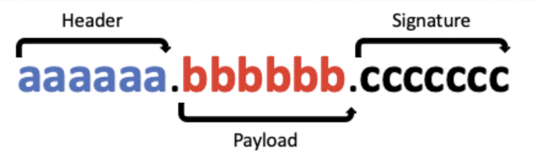
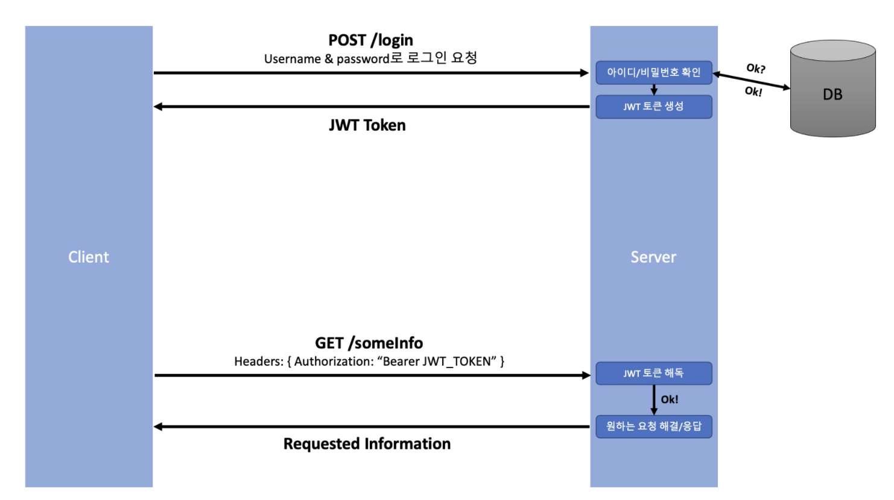

# Token

## Toekn 이란

토큰은 쉽게 말해 카드키 통행증, 회원증과 같은 개념입니다.  
클라이언트에서 로그인 할 시 서버에서 인증을 거친 다음 토큰을 내어주는 방식으로 서버에 다음 요청시 토큰을 같이 보내어 인증을 가집니다. 가장 대표적인 토큰 기반 인증은 jwt 방식이 있습니다.

 

### (핵심) 인증정보가 어디에 저장되는가?

세션은 서버(세션스토어)+클라이언트(세션id가 담긴 쿠키)에 저장됩니다. 반면에 토큰은 클라이언트(Authorizaion header)에 저장됩니다.(jwt)

 

## 토큰기반 인증의 특징 및 장점

1. Statelessness & Scalability (무사태성 & 확장성)
- 서버는 클라이언트에 대한 정보를 저장할 필요 없다. (토큰 해독이 되는지만 판단)
- 클라이언트는 새로운 요청을 보낼때마다 토큰을 헤더에 포함시키면 된다.
- 서버를 여러개 가지고 있는 서비스라면 더더욱 빛을 발휘한다.(같은 토큰으로 여러 서버에서 인증 가능)

 

2. 안전하다.
- 암호화 한 토큰을 사용하고, 암호화 키를 노칠 할 필요가 없기 때문에 안전(salt를 포함해서 토큰 암호화)

 

3. 어디서나 생성 가능하다.
- 토큰을 확인하는 서버가 토큰을 만들어야 하는 법이 없다.
- 토큰 생성용 서버를 만들거나, 다른 회사에서 토큰관련 작업을 맡기는 것 등 다양한 활용이 가능하다.

 

4. 권한 부여에 용이하다.
- 토큰의 payload안에 어떤 정보에 접근 가능한지 정할 수 있다.

 

## JWT의 종류

1. Access Token : 유효기간이 짧다.
- 권한을 부여할때 사용한다.
- 클라이언트가 처음 인증을 받게 될 때(로그인 시), acess, refresh token 두가지를 받지만, 실제로 권한을 얻는 데 사용하는 토큰은 access token이다.

 

2. Refresh Token : 기간이 길다.
- 만료되면 로그인이 풀린다.
- 엑세스 토큰을 새로 발급시켜 준고 이때, 유저는 다시 로그인 할 필요가 없다.

 

## jwt의 구조

 

1. Header
- 헤더는 이것이 어떤 종류의 토큰인지, 어떤 알고리즘으로 암호화 할지 적혀 있습니다. jwt에 알맞게 JSON형태로 볼수 있습니다.

 

2. Payload
- Payload는 정보가 담겨 있습니다. 어떤 정보에 접근 가능한지에 대한 권한을 담을 수도 있고, 사용자의 유저 이름 등 필요한 데이터는 이곳에 담아 암호화 시킵니다. (민감한 정보는 되도록 담지 않습니다.)

 

3. Signature
- 원하는 비밀 키(암호화에 추가할 salt)를 사용하여 암호화 합니다.

 

[토큰 정보 확인 하는 사이트](https://jwt.io/)

 

## Jwt 사용 시나리오

- JWT는 권한 부여에 굉장히 유용합니다. 새로 다운받은 A라는 앱이 Gmail과 연동되어 이메일을 읽어와야 한다고 가정

1. Gmail 인증서버에 로그인정보(아이디, 비밀번호)를 제공한다
2. 성공적으로 인증시 JWT 를 발급받는다
3. A앱은 JWT를 사용해 해당 유저의 Gmail 이메일을 읽거나 사용할 수 있다

 

## JWT 사용 흐름

 

1. 클라이언트가 아이디와 비밀번호를 담아 서버에 로그인 요청을 보냅니다.
2. 디비에서 아이디/비밀번호 를 확인후 일치한다면 클라이언트에게 암호화된 토큰을 생성합니다.(access/refresh)
3. 토큰을 클라이언트에게 보내주면 클라이언트는 토큰 저장합니다.(위치는 local storage,cookie,react state등)
4. 클라이언트가 http header에 토큰을 담아 보내 요청합니다. (bearer authentication 이용)
5. 서버는 클라가 보낸 토큰을 해독하고 발급해준 토큰이 맞다면 클라이언트의 요청을 처리 한 후 응답을 보내줍니다.