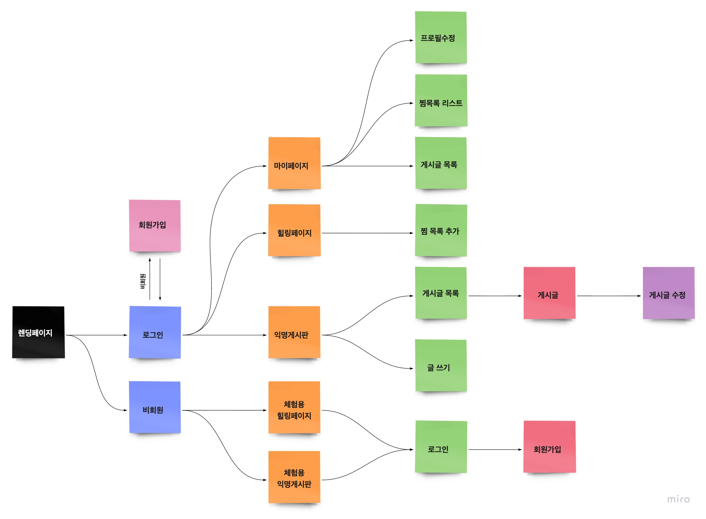
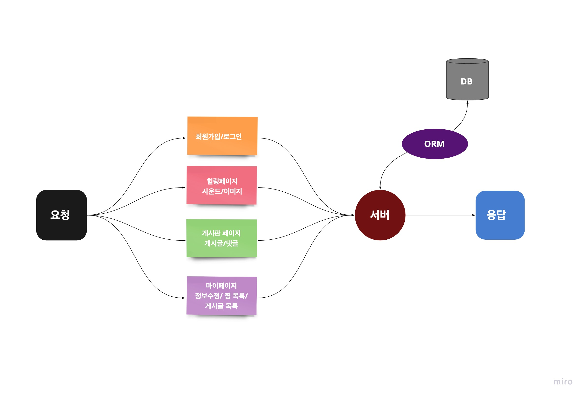
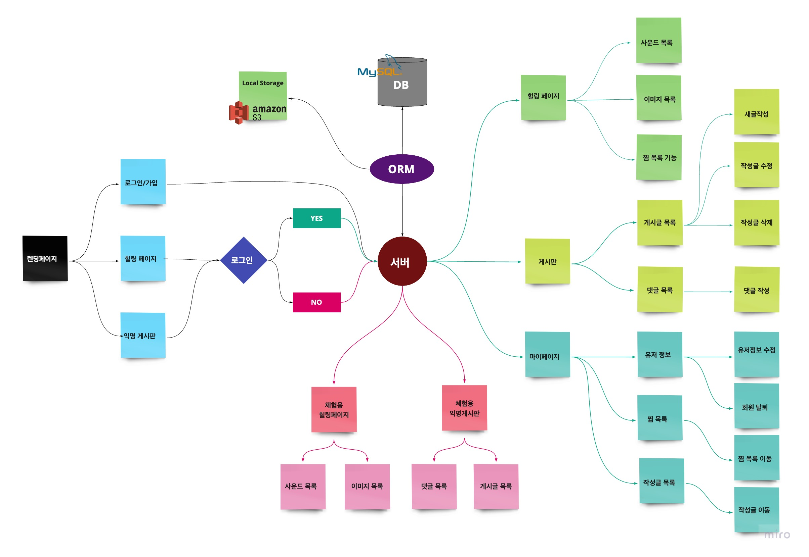

# Final_Project_dev #.1 ~ 5 (10.19~10.23)

---

## 여태 한 일들 

- 아이디어 기획
- 전반적인 테스크 관리
- 프로젝트 스케줄 구축
- 와이어프레임 가이드 라인 제시
- 플로우 차트 완료

 

### Client Side flow chart

 

### Server Side flow chart

 

### System Architecture

