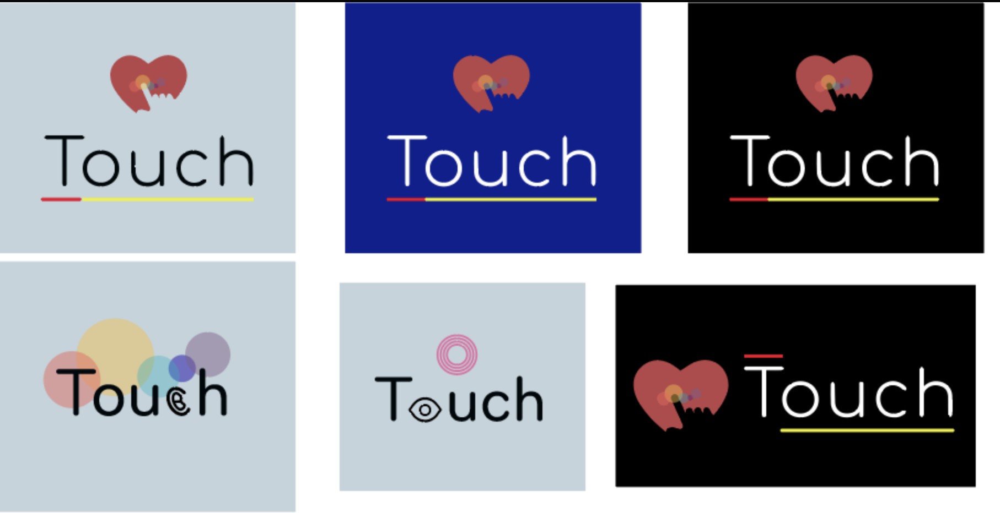

# Final_Project_dev #.6 (10.24)

---

## 1. 오늘 내가 한 일들 

- 로고 디자인
- 참고 레퍼런스 조사

 

## 2. 내일 내가 할 일

- 참고 레퍼런스 조사
- 로고 FIX
- 음원, 이미지 조사
- 간단하게 구도 만들어 보기

 

## 3. logo..

 

아직 수정 할 부분이 필요하다... 간단하게만 표현해 보았고 내일 팀원들과 상의해서 고쳐볼 예정이다!!

 

## 4. 느낌

황금 같은 주말이 녹아 버렸다...3주 안에 과연 할 수 있을지... 살짝 겁이나지만 충분히 해볼만한 도전이라고 생각한다!! SR기획은 마무리가 되었고 내일 부터는 진짜 코딩에 집중 할 수 있는 시간이 찾아 왔다!!! 2주차는 팀원들 각각 혼자서 생각과 고민을 하는 시간으로 합의를 했다! 이 일주일이 정말 중요한 시간이 될 것 같다! 즐기면서 밤세야 겠다!!