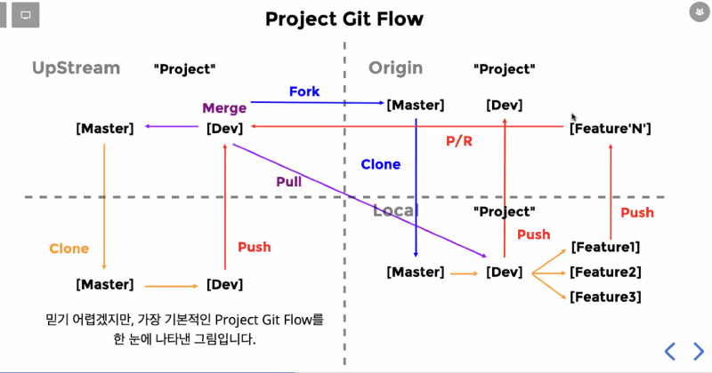

# Project_dev #.1

---

## 1. 오늘 내가 한 일

SR 계획 세우기, 기능 todolist 구체화 하기, 계획 스케줄표 만들기

 

## 2. 내일 내가 할 일

환경셋팅후 팀원들 레포 제공, 전반적인 SR계획 마무리, 팀룰 설정, wiki정리 

 

## 3. 숙지 내용

 

 

내일 배포를 하기 위해서 팀원들에게 레포를 전달해야 한다. 그전에 UpStream에서 포크가 아닌 클론을 받고 데브 브런치를 하나 생성하고 거기 안에서 서버와 클라 폴더를 만들어서 필요한 환경 셋팅을 다하고 다시 UpStream에다 Merge하는 작업을 하면 된다. 이 작업이 완료가 되면 팀원들에게 공지해서 포크 받을수 있도록 해야하고! 추가적으로 무조건 데브 브런치 기반으로 피쳐브런치에서 기능 구현을 하면 될것 같다. 그리고 머지할 경우는 무조건 팀원들에게 공유를 해야 하는것도 잊지 않아야 겠다!

## 4. 느낌..

많은걸 하려고 하는것 보단 여태 배운 내용을 복습한다라는 생각으로 기본에 충실 할 수 있도록 해야 겠다. 개발자가 되기 위한 과정이니 천천히 할 수 있는것부터 진행해보자!