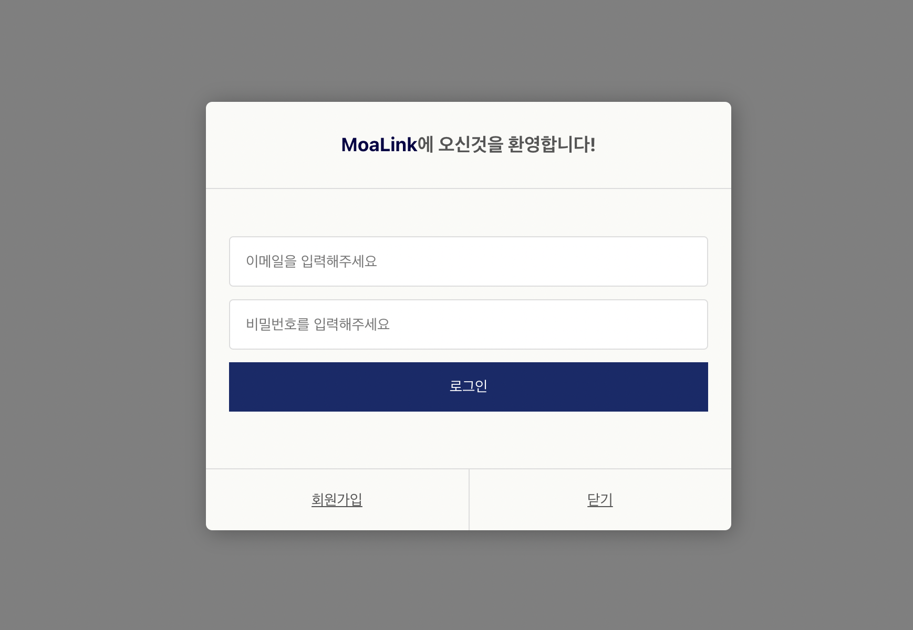
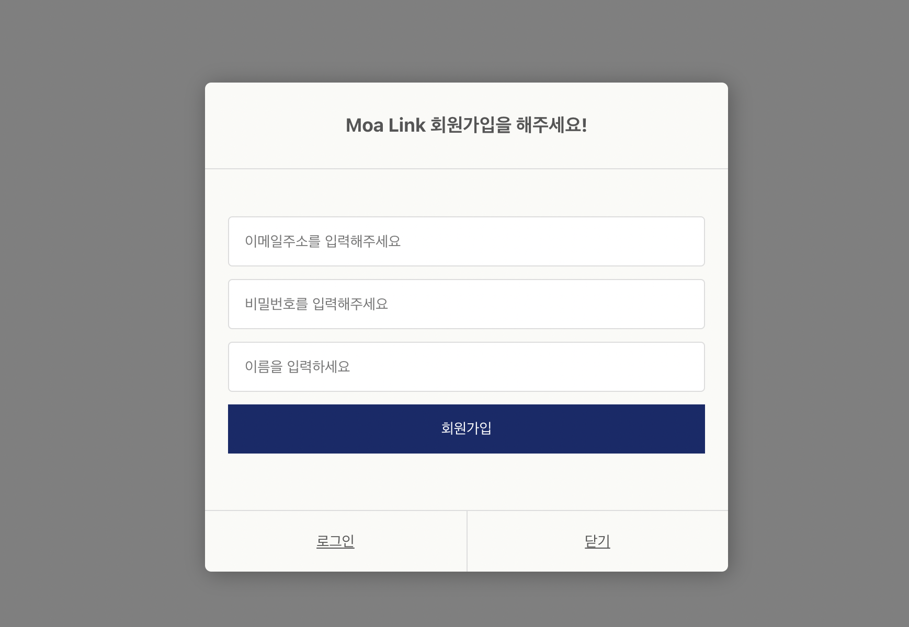

# Project_dev #.4 (10/11)

---

## 1. 오늘 내가 한 일

로그인 페이지, 회원가입 페이지, 로그인, 회원가입, 로그아웃 기능 완료

<br />

## 2. 내일 내가 할 일

KPT 회고작성, 코드 리뷰 후 깃 푸쉬, 여태 한 내용 코드 정리, 렌딩페이지 최종 마무리


<br />

## 3. 숙지 내용 및 알게 된 내용

### 1. app.js 로그인 권한, 로그아웃, 로그인 성공 함수, 라우터 프롭스 전달하기

app.js에서 로그인상태와 유저정보 상태를 관리하는 함수를 만들고 함수들을 라우터에서 프롭스로 전달 하였습니다.

```js
import React,{ useEffect, useState } from 'react';
import { Switch, Route, useHistory } from 'react-router-dom';
import LandingPage from './pages/LandingPage';
import LogIn from './pages/Login';
import SignUp from './pages/Signup';
import UrlPage from './pages/UrlPage';
import axios from 'axios';
import './App.css';

function App() {

  const [isLogin, setIsLogin] = useState(false);
  
  const [userinfo, setUserinfo] = useState(null);

  const history = useHistory();

  const isAuthenticated = () => {
     axios
        .get('https://localhost:4000/auth')
        .then((res)=>{
          setIsLogin(true);
          setUserinfo(res.data.data.userInfo)
          history.push('/');
        })
  };

  const handleLogout = () => {
    axios
      .post('https://localhost:4000/logout')
      .then(() => {
        setUserinfo(null);
        setIsLogin(false);
        history.push('/');
      });
  };

  const handleResponseSuccess = () => {
    isAuthenticated();
  };
  

  useEffect(() => {
    isAuthenticated();
  }, []);

  return (
    <>
      <Switch>

        <Route exact path="/">
          <LandingPage userinfo={userinfo} handleLogout={handleLogout} />
        </Route>
  
        <Route path="/UrlPage">
          <UrlPage userinfo={userinfo} handleLogout={handleLogout} />
        </Route>
  
        <Route path="/Login">
            <LogIn 
            isLogin={isLogin}
            handleResponseSuccess={handleResponseSuccess}
            />
        </Route>
   
        <Route path="/SignUp">
            <SignUp isLogin={isLogin}/>
        </Route>

      </Switch>
    </>
  );
}

export default App;
```

<br />

### 2. 각 페이지에 만든 함수 프롭스로 전달(상태 끌어올리기)

```js
// 렌딩페이지
function Landing({ userinfo, handleLogout }) {
    return (
        <div>
            <LandingHome userinfo={userinfo} handleLogout={handleLogout} />
        </div>
    )
}

export default Landing

// 로그인
import React from 'react'
import ToLogin from '../components/login/ToLogin';

function Login({ isLogin, handleResponseSuccess }) {
    return (
        <div>
            <ToLogin
                isLogin={isLogin}
                handleResponseSuccess={handleResponseSuccess}
            />
        </div>
    )
}

export default Login;

// url(마이페이지)
import React from 'react'
import Header from '../components/common/header/Header'
import UrlNavbar from '../components/urlNavbar/UrlNavbar'

function UrlPage({ userinfo, handleLogout }) {
    return (
        <div>
            <Header userinfo={userinfo} handleLogout={handleLogout} />
            <UrlNavbar/>
        </div>
    )
}

export default UrlPage
```

url에서는 헤더가 로그인상태를 유지하기 위해서 유저인포와 로그아웃 함수를 넣었고 로그아웃을 클릭하면 렌딩페이지로 갈 수 있게 설정 했습니다.

<br />


### 3. 헤더 로그인 할 때 유저정보 나오게 하기

```js
import React from 'react'
import {Link} from 'react-router-dom'
import '../header/Header.css'
import logo from '../../../img/moalink.png'
import axios from 'axios';


axios.defaults.withCredentials = true;


function Header({ userinfo, handleLogout }) {

    if(userinfo) {
        return (
          <div>
            <div className="header-background">
            <div className="header-container">
            <Link to="/" className="logo"></Link>
            <div className="grow"></div>
              <Link to="/UrlPage" className="header-flex-box">Url Service</Link>
              <div className="header-flex-box">{userinfo.username}</div>
              <button className="header-flex-box" onClick={handleLogout}>Logout</button>
            </div>
          </div>
          </div>
        );
      } else {
        return (
          <div>
              <div className="header-background">
            <div className="header-container">
            <Link to="/" className="logo"></Link>
            <div className="grow"></div>
            <Link to="/UrlPage" className="header-flex-box">Url Service</Link>
            <Link to="/LogIn" className="header-flex-box">Log in</Link>
            <Link to="/SignUp" className="header-flex-box">Sign Up</Link>
            </div>
            </div>
          </div>
        )
      }
    }

export default Header
```

로그인을 해서 유저정보가 들어올때 조건문을 사용해서 헤더가 변할수 있도록 구현 하였습니다.

<br />

추가적으로 로그인, 회원가입 와이어 프레입(영상은 시간이 없어서 사진으로..)

### 로그인 화면



<br />

### 회원가입 화면



<br />

기능구현 실험때문에 아직 미완성이다. 내일 최종적으로 마무리 해야겠다. 또 한 서버와 데이터베이스 연결을 해서 로그인과 회원가입이 다행이 잘된다.. 갈길이 너무 멀다 ㅠㅠ

<br />

## 4. 느낌

노베이스 상태에서 프로젝트를 진행하면서 수많은 에러들을 마주하게 되었다.. 거의 주말은 에러와의 전쟁이였다... 너무 많아서 에러 정리를 못했다.. 또 한 목표로 정했던 회원탈퇴기능 및 회원정보 수정 기능을 구현하지 못했다.. 시간적인 여유가 없어 구현하기가 너무 힘들었다... 하지만 이러한 시행착오들이 나를 성숙하게 만드는거 같아서 한편으로는 기분이 좋다! 앞으로 진짜 개발자가 된다면 이러한 과정을 수많이 겪을거 같다!! 그냥 익숙해지고 즐기도록 하장~!@!